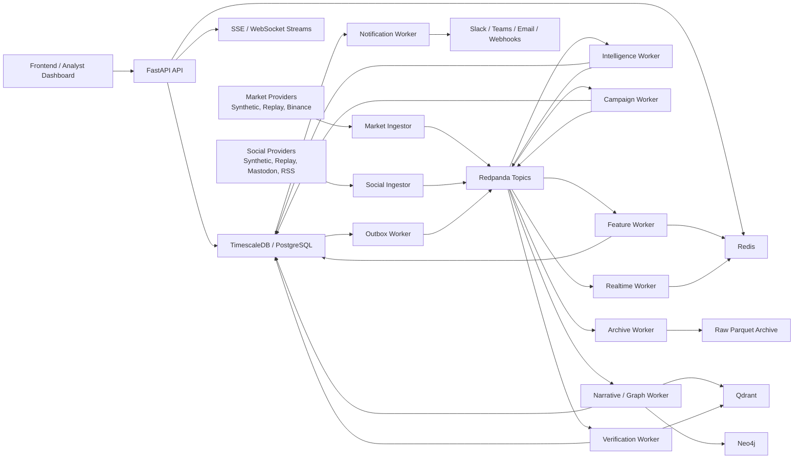
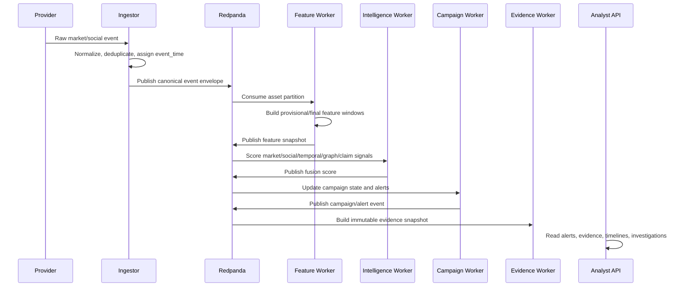

# Scam2Market Backend

Scam2Market is an event-time-aware intelligence backend for detecting suspected pump-and-dump and coordinated market-manipulation campaigns across market activity, social narratives, coordination graphs, disclosures, and analyst feedback.

The project is built as a production-shaped FastAPI backend with deterministic replay, real-time alerting, tenant-aware access control, model governance, evidence preservation, and deployable infrastructure references. It is designed for an analyst dashboard or external client to connect through stable REST, SSE, and WebSocket APIs.

> Current boundary: Phase 8 implements configurable official RSS/Atom, GitHub Releases, and SEC EDGAR recent-submission connectors plus analyst verification APIs. Feed/repository/CIK registrations, credentials, licensed-provider agreements, retention and attribution decisions, and real-world operational validation remain environment-owned. The repository does not bundle every regulator or licensed provider.

## Table Of Contents

- [Product Overview](#product-overview)
- [Core Capabilities](#core-capabilities)
- [Architecture](#architecture)
- [Data Flow](#data-flow)
- [Technology Stack](#technology-stack)
- [Repository Structure](#repository-structure)
- [Local Installation](#local-installation)
- [Running With Docker](#running-with-docker)
- [Frontend Integration](#frontend-integration)
- [Authentication And Tenancy](#authentication-and-tenancy)
- [API Surface](#api-surface)
- [Testing And Quality Gates](#testing-and-quality-gates)
- [CI/CD](#cicd)
- [Hosting And Deployment](#hosting-and-deployment)
- [Operations And SLOs](#operations-and-slos)
- [Security Model](#security-model)
- [Current Completion Status](#current-completion-status)
- [Known Gaps](#known-gaps)
- [Documentation Index](#documentation-index)

## Product Overview

Scam2Market focuses on intelligence, not marketplace transactions. The backend correlates market anomalies with social amplification, narrative formation, coordination-graph features, official disclosure evidence, replay evaluations, and analyst feedback. Its output is a set of explainable campaign states, alerts, evidence snapshots, model scores, and investigation workflows.

The system is useful for:

- detecting abnormal price/volume behavior around social hype;
- identifying coordinated narrative amplification;
- reducing false positives by checking whether claims were supported by disclosures before alert time;
- preserving immutable evidence for analysts and compliance workflows;
- replaying scenarios deterministically to evaluate detector behavior;
- integrating a dashboard, alert routing service, or external surveillance workflow.

## Core Capabilities

### Implemented Backend Capabilities

- Event-time surveillance pipeline using FastAPI, Redpanda, Redis, and TimescaleDB.
- Deterministic synthetic/replay market and social providers.
- Live Binance market provider scaffolding and live Mastodon/RSS social provider scaffolding.
- Normalized trade, candle, order-book, post, mention, narrative, score, campaign, alert, evidence, and investigation persistence.
- Rolling 1-minute and 5-minute feature windows with allowed lateness, lineage, revisions, and Redis latest state.
- Baseline market, social, coordination, temporal, claim-risk, legitimate-event, graph, and fusion scoring.
- Campaign state machine with merge rules, valid stage transitions, suppression, alert histories, and transactional outbox.
- Real-time alert streaming through SSE and WebSocket.
- Deterministic embeddings, narrative clustering, Qdrant indexing, and optional Neo4j graph projection.
- Deterministic claim extraction and event-time-bounded verification engine.
- Immutable evidence snapshots, chain-of-custody hashes, deterministic alert explanations, and audited access.
- Investigation assignment, events, tags, SLAs, feedback, adjudication, and false-positive reporting.
- Replay evaluation, detector ablations, MLflow experiment logging, governed aliases, calibration labels, and drift-aware promotion decisions.
- OIDC/JWT authentication, RBAC, tenant isolation, PostgreSQL row-level security, service-account key rotation, and API rate limiting.
- Notification delivery for Slack, Teams, email, and signed webhooks.
- Analyst dashboard served by the backend for operational validation and early triage.
- Terraform, Helm, production Compose, TLS gateway, backup/restore scripts, SLO rules, and CI/CD release bundle.

### What The Backend Does Not Pretend To Be

- It is not a trading engine, exchange, payment system, or marketplace.
- It does not execute trades or provide financial advice.
- It does not claim production-grade intelligence accuracy without labeled real-world calibration data.
- It does not bundle source registrations, credentials, licensed-provider agreements, or universal regulator coverage; operators onboard approved sources through governed policies.

## Architecture

Scam2Market uses a modular monolith for code ownership and operational simplicity, backed by event-streamed workers. Core state is persisted in TimescaleDB/PostgreSQL, low-latency state is cached in Redis, event flow is carried by Redpanda-compatible Kafka topics, and optional intelligence projections use Qdrant and Neo4j.



### Service Map

| Service | Responsibility |
|---|---|
| API | REST contract, auth, dashboard assets, readiness, metrics, SSE, WebSocket handshakes |
| Market ingestor | Provider polling, normalization, event-time assignment, deduplication, source health |
| Social ingestor | Social replay/live normalization, pseudonymization, parsing, asset resolution |
| Feature worker | Event-time windows, feature revisions, latest feature state, checkpoints |
| Intelligence worker | Baseline detectors, fusion scoring, missing-output handling |
| Campaign worker | Campaign state transitions, alert creation, suppression, outbox events |
| Narrative/graph worker | Embeddings, semantic clusters, graph projection, graph-derived features |
| Verification worker | Disclosure retrieval, claim verification, claim-risk evidence |
| Evidence worker | Immutable evidence snapshots and deterministic explanation records |
| Realtime worker | Redis Stream fanout for alert events |
| Notification worker | Tenant-scoped Slack, Teams, email, and signed webhook delivery |
| Replay scheduler | Deterministic replay and controlled evaluation scenarios |
| Archive worker | Immutable raw event archive for replay and audit support |

## Data Flow



## Technology Stack

| Layer | Technology | Why It Is Used |
|---|---|---|
| API | Python 3.12, FastAPI, Pydantic v2 | Strong async support, fast OpenAPI generation, typed request/response contracts |
| Persistence | PostgreSQL + TimescaleDB, SQLAlchemy 2, Alembic | Relational integrity plus time-series storage for trades, candles, windows, scores, and audit logs |
| Streaming | Redpanda/Kafka, aiokafka | Replayable event flow, partitioned processing, decoupled workers |
| Cache/state | Redis | Latest state, rate limiting, deduplication, realtime streams, worker coordination |
| Search/RAG | Qdrant | Disclosure chunks and social/narrative embedding search |
| Graph | Neo4j | Coordination graph projection and campaign/narrative relationship exploration |
| MLOps | MLflow | Experiment logging, model artifact metadata, governed alias workflow |
| Observability | Prometheus, Grafana, OpenTelemetry | Metrics, dashboards, SLOs, traces, dependency visibility |
| Auth | OIDC/JWT, RBAC, service-account keys | Tenant-aware frontend and service integration security |
| Deployment | Docker Compose, Caddy, Terraform AWS, Helm | Local demo, production-shaped Compose, cloud IaC, Kubernetes deployment |
| CI/CD | GitHub Actions, GHCR, SBOM, provenance attestation | Automated quality gates and immutable backend image publishing |

## Repository Structure

```text
.
|-- src/scam2market/              # Backend application and worker modules
|-- alembic/                      # Database migration chain
|-- tests/                        # Unit, integration, replay, auth, governance, operations tests
|-- docs/architecture/            # Domain model, service map, ADRs, scope reset
|-- docs/implementation/          # Phase and checkpoint implementation reports
|-- docs/operations/              # CI/CD, production readiness, backups, runbooks
|-- docs/planning/                # Implementation plans and future roadmap
|-- docs/research/                # Technical paper and research-oriented documentation
|-- contracts/openapi-v1.json     # Frozen frontend/API contract
|-- infra/terraform/aws/          # AWS reference infrastructure
|-- deploy/helm/scam2market/      # Kubernetes Helm chart
|-- ops/                          # TLS, Prometheus, Grafana, backup/restore operations assets
|-- scripts/                      # Topic creation, OpenAPI export, release validation
|-- docker-compose.yml            # Local development/demo stack
`-- docker-compose.production.yml # Production-shaped Compose override
```

## Local Installation

### Prerequisites

- Windows PowerShell, macOS shell, or Linux shell.
- Python 3.12.
- Docker Desktop with Compose v2.
- Git.
- Optional local tools for infrastructure validation: Terraform, Helm, Caddy, and Prometheus `promtool`.

### Clone

```powershell
git clone https://github.com/Harish-0412/Scam2Marke.git C:\SideQuest\Scam2Market
cd C:\SideQuest\Scam2Market
```

### Python Environment

```powershell
python -m venv .venv
.\.venv\Scripts\python.exe -m pip install --upgrade pip
.\.venv\Scripts\python.exe -m pip install -e ".[dev]"
```

### Environment Configuration

The default Compose stack reads `.env.example`, which is development-only. For custom local settings:

```powershell
Copy-Item .env.example .env.local
$env:SCAM2MARKET_ENV_FILE=".env.local"
```

Do not commit real keys, provider tokens, database passwords, OIDC secrets, webhook secrets, or production configuration files.

## Running With Docker

### Core Backend

```powershell
docker compose up --build
```

Local URLs:

- API docs: `http://localhost:8000/docs`
- Analyst dashboard: `http://localhost:8000/dashboard/`
- Health: `http://localhost:8000/api/v1/health`
- Readiness: `http://localhost:8000/api/v1/ready`
- Metrics: `http://localhost:8000/api/v1/metrics`

### Run Deterministic Demo Replay

```powershell
docker compose --profile demo up replay-scheduler
```

### Run Intelligence Services

```powershell
docker compose --profile intelligence up --build
```

This enables optional Qdrant, Neo4j, MLflow, narrative, graph, and verification workers.

### Run Observability

```powershell
docker compose --profile observability up --build
```

Observability URLs:

- Prometheus: `http://localhost:9090`
- Grafana: `http://localhost:3001`
- Neo4j: `http://localhost:7474`
- Qdrant: `http://localhost:6333`
- MLflow: `http://localhost:5000`

## Frontend Integration

The frontend should connect to the FastAPI backend through the versioned API and OpenAPI contract:

- OpenAPI runtime docs: `http://localhost:8000/docs`
- Frozen contract: `contracts/openapi-v1.json`
- Auth check: `GET /api/v1/auth/me`
- Readiness: `GET /api/v1/ready`
- Alert stream: `GET /api/v1/stream/alerts`
- WebSocket stream: `WS /api/v1/ws/alerts?after_id={redis_stream_id}`

Development auth is enabled by default. Production deployments should disable development headers and require OIDC/JWT or service-account credentials.

Common frontend workflows:

- display watchlists and asset overview;
- show latest feature and score state for each asset;
- render campaign stage history and evidence graph;
- stream alerts in real time;
- acknowledge alerts and create investigations;
- record analyst feedback and false-positive reports;
- inspect model governance, replay runs, and operational readiness.

## Authentication And Tenancy

Scam2Market supports:

- OIDC/JWT authentication for users;
- development header auth for local-only workflows;
- service-account keys with hashed storage and key rotation;
- tenant-aware memberships and role-based permissions;
- PostgreSQL row-level security policies for tenant-scoped records;
- audit logs for sensitive access and evidence retrieval.

Production configuration should set:

```env
AUTH_REQUIRED=true
DEVELOPMENT_AUTH_ENABLED=false
RATE_LIMIT_FAIL_CLOSED=true
OIDC_ISSUER=<issuer>
OIDC_AUDIENCE=<audience>
OIDC_JWKS_URL=<jwks-url>
SERVICE_KEY_PEPPER=<managed-secret>
ALLOWED_ORIGINS=https://your-frontend-domain.example
```

## API Surface

Major API groups:

- `/api/v1/auth/*` for tenants, memberships, users, and service accounts.
- `/api/v1/watchlists/*` for watchlists and asset membership.
- `/api/v1/assets/*` for overviews, scores, timelines, and narratives.
- `/api/v1/market/*` and `/api/v1/social/*` for source state and latest observations.
- `/api/v1/features/*` for latest event-time feature windows.
- `/api/v1/intelligence/*` for fused risk score output.
- `/api/v1/campaigns/*` and `/api/v1/alerts/*` for campaign and alert workflows.
- `/api/v1/evidence/*` for immutable evidence manifests.
- `/api/v1/investigations/*` and `/api/v1/feedback/*` for analyst workflows.
- `/api/v1/replays/*` and `/api/v1/evaluation/*` for replay and metrics.
- `/api/v1/models/*` and `/api/v1/model-governance/*` for artifacts, aliases, calibration, and promotion.
- `/api/v1/notifications/*` for notification channels and subscriptions.
- `/api/v1/operations/*` for drift, policy proposals, checkpoints, and readiness.

## Testing And Quality Gates

Run local checks:

```powershell
.\.venv\Scripts\python.exe -m ruff format --check src tests scripts alembic
.\.venv\Scripts\python.exe -m ruff check src tests scripts alembic
.\.venv\Scripts\python.exe -m mypy src tests
.\.venv\Scripts\python.exe -m pytest
.\.venv\Scripts\alembic.exe upgrade head
.\.venv\Scripts\python.exe scripts\validate_operations.py
```

Validate Compose and release contract:

```powershell
docker compose config --quiet
docker compose --profile intelligence --profile observability up --detach --build
docker compose --profile demo run --rm replay-scheduler
.\.venv\Scripts\python.exe scripts\verify_release.py
```

## CI/CD

GitHub Actions runs:

- Ruff formatting and lint checks.
- Strict MyPy checks.
- Alembic upgrade, downgrade, and re-upgrade.
- Full Pytest suite against TimescaleDB.
- Docker build and Compose validation.
- Terraform validation.
- Helm chart linting.
- Operations image build.
- Complete Compose replay regression.

The CD workflow publishes a backend image to GitHub Container Registry:

```text
ghcr.io/harish-0412/scam2marke-backend
```

The release process uses immutable image digests, SBOM generation, provenance attestation, and a short-retention deployment bundle.

Public GitHub repositories can use standard GitHub-hosted Actions runners without charge, subject to GitHub's current limits and policy. Runtime hosting, managed databases, private runners, paid runners, commercial APIs, and long-term artifacts may create cost.

## Hosting And Deployment

### Recommended Split

| Component | Recommended Host | Notes |
|---|---|---|
| Frontend dashboard | Vercel, Netlify, Cloudflare Pages, or static hosting | Vercel is a good frontend choice, but it should not host this long-running backend directly. |
| FastAPI backend | Fly.io, Render, Railway, Azure Container Apps, AWS ECS/EKS, GCP Cloud Run, or Kubernetes | Needs long-running workers, private networking, secrets, and service dependencies. |
| Workers | Same container platform as backend or Kubernetes | Keep near Redpanda/Redis/DB for low latency. |
| TimescaleDB/PostgreSQL | Managed Timescale, Tiger Cloud, Neon Postgres for non-Timescale dev, Supabase Postgres for dev | Production needs TimescaleDB features or an equivalent time-series plan. |
| Redis | Upstash Redis, Redis Cloud, Railway Redis, Render Redis, AWS ElastiCache | Used for cache, streams, rate limits, and checkpoints. |
| Redpanda/Kafka | Redpanda Cloud, Aiven Kafka, Confluent Cloud, Upstash Kafka, AWS MSK | Use TLS and private networking for production. |
| Qdrant | Qdrant Cloud or self-hosted container | Optional enrichment; baseline scoring degrades cleanly without it. |
| Neo4j | Neo4j Aura or self-hosted container | Optional graph projection and evidence exploration. |
| MLflow | Managed tracking service, self-hosted MLflow, or artifact-only local mode | Needed for mature model registry workflows. |
| Object storage | S3, Cloudflare R2, Backblaze B2, or MinIO | Raw archive, backups, evidence exports, and model artifacts. |

### Production Compose

For a single-host deployment:

```powershell
Copy-Item .env.production.example .env.production
# Fill every placeholder from a secret manager or protected environment.
docker compose --env-file .env.production `
  -f docker-compose.yml `
  -f docker-compose.production.yml `
  --profile intelligence `
  --profile observability `
  up --detach --no-build
```

The production override removes public data-service ports, enables stricter auth/rate-limit settings, runs the API behind Caddy TLS, and expects real secrets.

### Kubernetes / AWS Reference

The repository includes:

- `infra/terraform/aws` for private AWS networking, EKS, MSK, Redis, KMS, ACM, S3 backups, and workload IAM.
- `deploy/helm/scam2market` for digest-pinned Kubernetes deployment, probes, HPA, PDB, network policy, backup jobs, and restore drills.
- `ops/prometheus/rules/scam2market-slo.yml` for availability and latency SLO alerts.
- `ops/backup` for encrypted logical backups and isolated restore drills.

Actual cloud provisioning requires environment-owned credentials, DNS, a domain, provider accounts, and managed database secrets.

## Operations And SLOs

Default production objectives:

| Indicator | Objective |
|---|---|
| Authenticated API availability | 99.9% over 30 days |
| API p95 latency | Under 500 ms over 5 minutes |
| Alert event to notification enqueue p95 | Under 30 seconds |
| Source freshness | Within configured thresholds for 99% of windows |
| Logical backup | At least one successful encrypted backup per 24 hours |
| Restore drill | One successful isolated restore every week |

Operational runbooks live in `docs/operations`.

## Security Model

Security controls include:

- OIDC/JWT authentication and development-auth isolation.
- Tenant-aware RBAC and PostgreSQL row-level security.
- Rotatable service-account keys stored as hashes.
- Redis token-bucket rate limiting.
- Non-root containers and read-only production API filesystem.
- TLS gateway and private data-service ports in production Compose.
- Network policy, immutable digests, and workload identity in Helm.
- Prompt-injection and data-poisoning guardrails for untrusted text.
- Audit logs for evidence and sensitive access.
- SBOM and provenance attestation in CD.

## Current Completion Status

| Phase | Status |
|---|---|
| 0 Product reset and architecture lock | Complete |
| 1 Foundation, infrastructure, contracts | Complete for local/dev |
| 2 Market ingestion and replay | Complete for deterministic demo; live hardening remains |
| 3 Social ingestion and asset resolution | Complete for deterministic demo; licensed-source hardening remains |
| 4 Feature windows and online state | Complete with durable checkpoint support |
| 5 Baseline detectors and fusion | Complete baseline with governance extensions |
| 6 Campaign and alert engine | Complete core implementation |
| 7 Narrative, embeddings, coordination graph | Complete deterministic baseline with optional graph/vector services |
| 8 Disclosure and claim verification | Complete backend implementation with configurable official connectors, governed source policies, versioned evidence, and analyst APIs |
| 9 Evidence, explainability, analyst workflow | Implemented with evidence snapshots, investigations, feedback, and audit |
| 10 Replay, evaluation, MLOps | Implemented with evaluation, ablations, MLflow hooks, aliases, and shadow scoring |
| 11 Reliability, security, hardening | Implemented for production-shaped deployment |
| 12 Contract, demo, deployment | Implemented for frozen API and deployable release artifacts |

## Known Gaps

- Official source registrations, credentials, licensed-provider agreements, retention rules, and attribution decisions remain environment-owned.
- The included RSS/Atom, GitHub Releases, and SEC EDGAR connectors require production feed/CIK onboarding and long-duration validation; additional regulators without compatible feeds require connector implementations.
- Live exchange/social providers need production credentials, rate-limit policy, replay parity tests, and long-duration validation.
- Real-world model quality requires labeled datasets, hard negatives, continuous calibration, and analyst feedback loops.
- Public cloud deployment is validated through IaC and Compose contracts but not provisioned in this repository.
- Managed secrets, DNS, domain ownership, and production credentials must be supplied outside Git.

## Additional High-Value Services

Slack, Teams, email, and signed webhooks are implemented. Remaining high-value expansions include:

- portfolio intelligence;
- cross-platform entity resolution;
- historical campaign matching;
- adversarial simulation;
- signed evidence exports;
- SIEM integration;
- vulnerability scanning;
- automated dependency updates.

See [Future Enhancements And Hosting Strategy](docs/planning/FUTURE_ENHANCEMENTS_AND_HOSTING.md) for implementation sequencing and free-tier deployment options.

## Documentation Index

Planning:

- [Advanced Implementation Review And Corrected Architecture](docs/planning/Scam2Market_Backend_Advanced_Implementation_Review.md)
- [Complete Project Blueprint](docs/planning/Scam2Market_Project_Blueprint.md)
- [Backend Phase Distribution](docs/planning/BACKEND_PHASE_DISTRIBUTION.md)
- [Initial Backend Implementation Plan](docs/planning/BACKEND_IMPLEMENTATION_PLAN.md)
- [Next Services Roadmap](docs/planning/NEXT_SERVICES_ROADMAP.md)
- [Future Enhancements And Hosting Strategy](docs/planning/FUTURE_ENHANCEMENTS_AND_HOSTING.md)

Architecture:

- [Domain Model](docs/architecture/domain-model.md)
- [Service Map](docs/architecture/service-map.md)
- [Scope Reset](docs/architecture/scope-reset.md)
- [Architecture Decision Records](docs/architecture/decisions)

Implementation:

- [Phases 2-5 Implementation Notes](docs/implementation/phases-2-5.md)
- [Phases 6-8 Implementation Notes](docs/implementation/phases-6-8.md)
- [Phases 9-10 Implementation Report](docs/implementation/PHASE_9_10_IMPLEMENTATION_REPORT.md)
- [Phases 11-12 Implementation Report](docs/implementation/PHASE_11_12_IMPLEMENTATION_REPORT.md)
- [Authentication And Tenant Isolation](docs/implementation/CHECKPOINT_1_AUTH_TENANCY.md)
- [Live Providers And Durable Checkpoints](docs/implementation/CHECKPOINT_2_LIVE_PROVIDERS.md)
- [Analyst Dashboard And Notifications](docs/implementation/CHECKPOINT_3_DASHBOARD_NOTIFICATIONS.md)
- [Calibration, Promotion, And False Positives](docs/implementation/CHECKPOINT_4_MODEL_GOVERNANCE.md)
- [Production Infrastructure, Recovery, TLS, And SLOs](docs/implementation/CHECKPOINT_5_PRODUCTION_OPERATIONS.md)

Operations:

- [CI/CD Pipeline](docs/operations/CI_CD_PIPELINE.md)
- [Production Readiness](docs/operations/PRODUCTION_READINESS.md)
- [Production Runbook](docs/operations/PRODUCTION_RUNBOOK.md)
- [Backup And Restore Runbook](docs/operations/BACKUP_RESTORE_RUNBOOK.md)

Research:

- [Technical Paper Source](docs/research/Scam2Market_Technical_Paper.md)
- Technical paper Word document: `docs/research/Scam2Market_Technical_Paper.docx`
