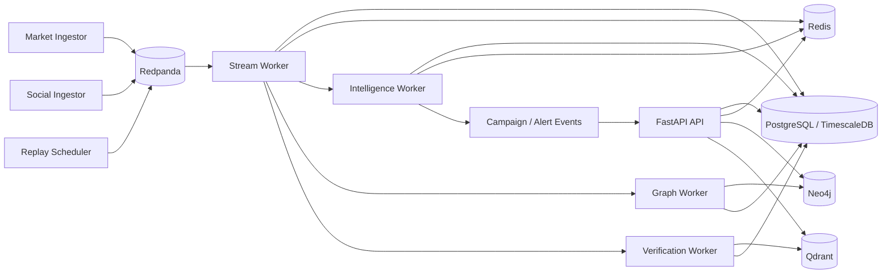

# Scam2Market Service Map

The hackathon backend is a modular monolith plus worker processes. Services share schemas and storage contracts, but each process owns a clear responsibility.

## Process Responsibilities

| Process | Responsibility |
|---|---|
| API | Control plane, dashboard REST endpoints, WebSocket/SSE, health/config. |
| Market Ingestor | Live/replayed market adapters, normalization, event publication. |
| Social Ingestor | Social replay/adapters, normalization, asset mention extraction. |
| Stream Worker | Deduplication, event-time assignment, persistence, feature-window updates. |
| Intelligence Worker | Baseline detectors, fusion, campaign and alert state. |
| Graph Worker | Neo4j projection and graph features. |
| Verification Worker | Time-bounded disclosure/claim verification. |
| Replay Scheduler | Virtual-clock replay and scenario isolation. |
