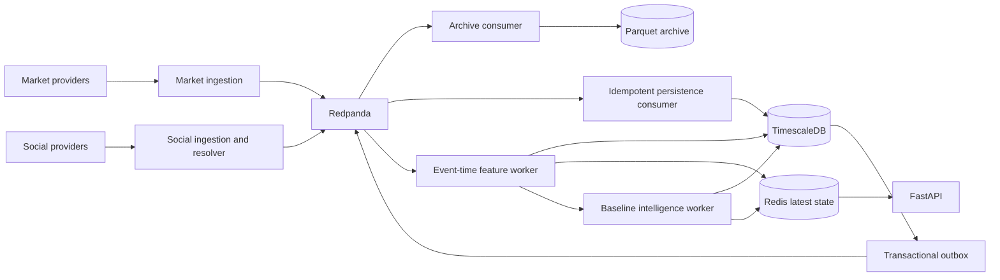

# Phases 2-5 Backend Implementation

## Runtime Flow



## Phase 2: Market Ingestion And Replay

Implemented contracts:

- `MarketProvider` asynchronous interface;
- deterministic `ReplayProvider` with logical origin IDs and replay-delivery IDs;
- controlled `SyntheticProvider` containing baseline, pump, and sell-pressure events;
- normalized `MarketTrade`, `MarketCandle`, and `OrderBookUpdate` records;
- top-five depth, spread, and imbalance derivation;
- Redis fast-path deduplication plus a globally unique key in a regular PostgreSQL table;
- `VALID`, `STALE`, `GAP_DETECTED`, `RESYNCING`, and `RECOVERED` book states;
- invalid books persist with null microstructure features until recovery;
- Timescale hypertables for trades, candles, books, and book features;
- immutable date/source-partitioned Parquet objects compressed with Zstandard;
- latest market state and per-source health API endpoints.

The optional Binance adapter is intentionally deferred because the selected demo source is
`synthetic-pump-v1`; the provider interface can accept a live adapter without changing ingestion.

## Phase 3: Social Ingestion And Resolution

Implemented contracts:

- deterministic `SocialReplayProvider` and `SyntheticSocialProvider`;
- versioned HMAC-SHA256 author pseudonyms with no raw author ID downstream;
- stable post IDs based on source and source post ID;
- hashtag, cashtag, URL, and user-mention parsing;
- Unicode-normalized resolver output with confidence, candidates, status, and reason code;
- explicit `AMBIGUOUS` output for common-word aliases unless context is sufficiently explicit;
- separate raw-safe, normalized-post, and asset-mention stream events;
- normalized post and mention persistence plus latest social/source health APIs.

## Phase 4: Feature Windows

Implemented contracts:

- 60-second and 300-second windows aligned by event time;
- isolated `LIVE` and replay-session computation scopes for repeatable reruns;
- configurable lateness plus market, social, and minimum fusion watermarks;
- healthy-idle and unavailable/degraded source states with different feature semantics;
- `PROVISIONAL`, `FINAL`, and late-arrival `CORRECTED` revisions;
- immutable feature revision history and source-event lineage hashes;
- manifest-driven ordered `surveillance-features-v2` inputs and schema hash validation;
- market, social, temporal, quality, and baseline-confidence feature groups;
- Redis latest snapshots and Timescale/PostgreSQL durable snapshots;
- deterministic replay behavior for identical ordered inputs.

Persistence and archive consumers save durable per-topic/partition checkpoints before committing
their Redpanda offset. The feature worker deliberately leaves offsets uncommitted and rebuilds from
retained events because its full rolling state is not yet checkpointed. Stable signal, window,
lineage, and derived-event identities keep that correctness-first fallback idempotent. The shared
checkpoint schema includes a feature-state version for a later snapshot-and-tail optimization.

Finalized revisions remain reproducible because each revision stores its exact source event IDs,
event-time range, source hash, schema version, and feature values.

## Phase 5: Baseline Detection And Fusion

Implemented detectors:

- grouped direction, activity, stress, and optional-valid-microstructure market blend;
- mention, author, hashtag, and new-author social surge blend;
- author/repost/URL concentration coordination heuristics;
- social-to-market lead/lag score;
- market regime and asset liquidity classification;
- optional peer-relative cross-asset baseline.

Fusion v2 uses versioned weights and thresholds. It emits separate market-anomaly,
social-coordination, and cross-domain risks. A calibration adapter can be supplied once a
validated calibration dataset is available; uncalibrated heuristic scores are explicitly marked as
such. Missing outputs remain `null` with coded reasons. Social coordination may become `HIGH` on
its own, while cross-domain manipulation cannot exceed `WATCH` without market corroboration.
Legitimate-event context applies a bounded adjustment to the raw cross-domain score and cannot
erase strongly corroborated evidence. Regime and liquidity classifications carry independent
confidence values.

## Operational Commands

```powershell
docker compose up --build -d
docker compose --profile demo up replay-scheduler
```

Local validation:

```powershell
.\.venv\Scripts\python.exe -m pytest -q
.\.venv\Scripts\python.exe -m ruff check src tests scripts alembic
.\.venv\Scripts\python.exe -m mypy src tests
.\.venv\Scripts\alembic.exe upgrade head
```

The core Compose stack starts migrations, topic initialization, API, feature worker, intelligence
worker, and outbox recovery worker. The demo profile creates a tracked replay session and runs both
finite synthetic providers.
