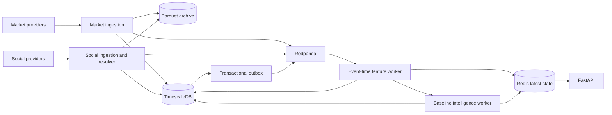

# Phases 2-5 Backend Implementation

## Runtime Flow



## Phase 2: Market Ingestion And Replay

Implemented contracts:

- `MarketProvider` asynchronous interface;
- deterministic `ReplayProvider` with stable event IDs per replay session;
- controlled `SyntheticProvider` containing baseline, pump, and sell-pressure events;
- normalized `MarketTrade`, `MarketCandle`, and `OrderBookUpdate` records;
- top-five depth, spread, and imbalance derivation;
- Redis fast-path deduplication plus `event_ingestion_log.dedupe_key` durability;
- sequence-gap, out-of-order, freshness, and degraded-source tracking;
- Timescale hypertables for trades, candles, books, and book features;
- immutable date/source-partitioned Parquet objects compressed with Zstandard;
- latest market state and per-source health API endpoints.

The optional Binance adapter is intentionally deferred because the selected demo source is
`synthetic-pump-v1`; the provider interface can accept a live adapter without changing ingestion.

## Phase 3: Social Ingestion And Resolution

Implemented contracts:

- deterministic `SocialReplayProvider` and `SyntheticSocialProvider`;
- HMAC-SHA256 author pseudonyms with no raw author ID in Parquet or Redpanda output;
- stable post IDs based on source and source post ID;
- hashtag, cashtag, URL, and user-mention parsing;
- versioned registry resolver with confidence, candidate IDs, and resolution status;
- explicit `AMBIGUOUS` output for common-word aliases unless context is sufficiently explicit;
- separate raw-safe, normalized-post, and asset-mention stream events;
- normalized post and mention persistence plus latest social/source health APIs.

## Phase 4: Feature Windows

Implemented contracts:

- 60-second and 300-second windows aligned by event time;
- isolated `LIVE` and replay-session computation scopes for repeatable reruns;
- configurable allowed lateness and per-asset watermarks;
- provisional and final revisions, including new final revisions for late events;
- immutable feature revision history and source-event lineage hashes;
- exact ordered `surveillance-features-v1` model input validation;
- market, social, temporal, quality, and baseline-confidence feature groups;
- Redis latest snapshots and Timescale/PostgreSQL durable snapshots;
- deterministic replay behavior for identical ordered inputs.

The feature worker deliberately rebuilds from retained Redpanda inputs after restart. Stable signal,
window, lineage, and derived-event identities make this replay idempotent, while the rebuild also
restores Redis latest state. Moving to checkpointed Flink/Bytewax state is a later scale decision,
not a correctness dependency for this build.

Finalized revisions remain reproducible because each revision stores its exact source event IDs,
event-time range, source hash, schema version, and feature values.

## Phase 5: Baseline Detection And Fusion

Implemented detectors:

- price, volume, volatility, and microstructure market anomaly blend;
- mention, author, hashtag, and new-author social surge blend;
- author/repost/URL concentration coordination heuristics;
- social-to-market lead/lag score;
- market regime and asset liquidity classification;
- optional peer-relative cross-asset baseline.

Fusion v1 uses versioned weights and thresholds. A calibration adapter can be supplied once a
validated calibration dataset is available; uncalibrated heuristic scores are explicitly marked as
such. Missing outputs remain `null` and are listed in
`missing_outputs`; they are never converted into benign zeroes. Social evidence without market
corroboration cannot exceed `WATCH`, and `CRITICAL` requires strong market evidence, another strong
signal, and adequate confidence. Legitimate-event evidence discounts the final risk score.

## Operational Commands

```powershell
docker compose up --build -d
docker compose --profile demo up replay-scheduler
```

Local validation:

```powershell
.\.venv\Scripts\python.exe -m pytest -q
.\.venv\Scripts\python.exe -m ruff check src tests scripts alembic
.\.venv\Scripts\python.exe -m mypy src tests
.\.venv\Scripts\alembic.exe upgrade head --sql
```

The core Compose stack starts migrations, topic initialization, API, feature worker, intelligence
worker, and outbox recovery worker. The demo profile creates a tracked replay session and runs both
finite synthetic providers.
