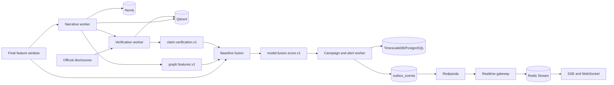

# Phases 6-8 Implementation

This document records the implemented campaign, graph, narrative, disclosure, and verification
architecture. It complements the planning documents and describes the runtime contracts that are
now enforced by code and tests.

## Runtime Flow

## Phase 6: Campaign And Alert Engine

### State And Concurrency

- One active campaign is permitted per `scope_id` and `asset_id` through a partial unique index.
- A PostgreSQL transaction advisory lock serializes creation and updates even when no campaign row
  exists yet; existing campaign and alert rows are additionally selected `FOR UPDATE`.
- `campaign_evidence.evidence_event_id` is the durable idempotency boundary.
- Campaigns merge while evidence remains within `CAMPAIGN_MERGE_GAP_SECONDS`; older active
  campaigns close before a new campaign begins.
- Every transition is validated by `CampaignStateMachine`. Invalid stage jumps are rejected.

Implemented stages:

1. `NORMAL`
2. `EARLY_SOCIAL_SEEDING`
3. `COORDINATED_AMPLIFICATION`
4. `MARKET_PUMP`
5. `DISTRIBUTION`
6. `DUMP`
7. `POST_EVENT`

### Alert Policy

The engine maps explicit market, social, graph, claim, and stage signals into the required eight
alert types. Each `(campaign_id, alert_type)` has one persistent alert row. Repeated evidence
increments occurrence count; unchanged alerts inside `ALERT_SUPPRESSION_SECONDS` are recorded in
history but do not emit another notification. Severity or status changes bypass suppression.

Campaign updates, histories, alert changes, and `outbox_events` are committed in one transaction.
The existing outbox dispatcher publishes those domain events to `campaign.events.v1` and
`alerts.events.v1`.

### Real-Time Delivery

The real-time gateway consumes alert events and appends them to a bounded Redis Stream. Redis
Stream IDs provide reconnect cursors for:

- `GET /api/v1/stream/alerts` using the `Last-Event-ID` header;
- `WS /api/v1/ws/alerts?after_id={stream_id}`.

This avoids losing alerts when a dashboard disconnects briefly.

## Phase 7: Narrative, Embeddings, And Coordination Graph

### Reproducible Baseline

- `DeterministicHashEmbedding` provides offline, replay-stable vectors without model downloads.
- Every Qdrant point includes post, asset, scope, event-time, and embedding-version metadata.
- Clustering sorts post IDs, uses cosine-similarity union-find, and derives narrative IDs from the
  complete cluster membership. Input order therefore cannot alter replay output.
- Labels, summaries, cluster centroids, and membership similarities are deterministic.

The embedding provider and vector index are protocols, so a production transformer embedding
provider can replace the deterministic baseline without changing the clustering or persistence
contracts.

### Graph Projection

The Neo4j adapter uses parameterized, idempotent `MERGE` queries and projects `Actor`, `Post`,
`Asset`, `Narrative`, `Campaign`, and `Alert` nodes. Relationships include `POSTED`, `MENTIONS`,
`MEMBER_OF`, `REPLIES_TO`, `REPOSTS`, `AMPLIFIES`, `TARGETS`, `EVIDENCE_FOR`, and
`SUPPORTED_BY`.

Persisted graph features are:

- community concentration;
- synchronized posting;
- repeated URL/hashtag amplifier overlap;
- propagation depth;
- community entropy;
- time to 10 and 100 authors;
- cross-community spread;
- node-to-narrative similarity;
- composite graph score.

Qdrant or Neo4j failures produce a `DEGRADED` graph snapshot. Narrative records and deterministic
graph features still persist, and baseline fusion continues with a coded missing `graph_score`.

## Phase 8: Disclosure And Claim Verification

### Ingestion And Retrieval

Official disclosure events are normalized, content-hashed, chunked, persisted, and embedded into a
separate Qdrant collection. PostgreSQL remains authoritative when Qdrant is unavailable.

Retrieval is constrained to the relevant asset and a configured event-time interval around the
alert. Candidates published after `alert_time` are retained only to classify
`SUPPORTED_AFTER_ALERT`; they can never produce contemporaneous support or a legitimate-event
discount for the past alert.

### Deterministic Verification

Narrative claims receive stable hashes and IDs. Token overlap, source reliability, publication
time, and negation conflict produce one of:

- `SUPPORTED_BEFORE_ALERT`;
- `SUPPORTED_AFTER_ALERT`;
- `UNSUPPORTED`;
- `CONFLICTING`;
- `UNKNOWN`.

Each result stores document IDs, publication timestamps, similarity scores, the alert cutoff,
temporal-filter metadata, deterministic reasoning, claim risk, and legitimate-event score. An LLM
may add an explanation, but LLM failure cannot alter or block the deterministic result.

## Fusion Enrichment

Baseline scores keep model version `fusion-v2`. Optional evidence creates traceable versions:

- `fusion-v2+graph`;
- `fusion-v2+verification`;
- `fusion-v2+graph+verification`.

Graph evidence participates in fusion weighting. A supported pre-alert official event lowers risk
through `legitimate_event_score`; unsupported or future-only claims retain elevated claim risk.
Missing enrichment remains explicit in `missing_outputs`.

## New Storage

- `campaigns`, `campaign_evidence`, `campaign_stage_history`
- `alerts`, `alert_state_history`, `outbox_events`
- `narratives`, `narrative_posts`
- `graph_snapshots`, `graph_features`
- `disclosures`, `disclosure_chunks`
- `claims`, `claim_verifications`

## Verification Coverage

Automated tests assert:

- duplicate evidence cannot create duplicate alerts;
- all demonstrated campaign transitions are valid;
- severity history and cooldown suppression are recorded;
- concurrent updates produce one campaign;
- WebSocket clients receive replayed alert events;
- embeddings contain asset/time metadata;
- clustering is replay deterministic;
- graph edges and graph features are created;
- graph failure does not remove narrative or baseline output;
- graph score is safely optional in fusion;
- future disclosures do not justify past alerts;
- unsupported claims increase risk;
- supported pre-alert disclosures reduce claim risk;
- retrieval metadata contains source IDs, timestamps, and cutoff policy;
- LLM failure leaves the deterministic verification result intact.
