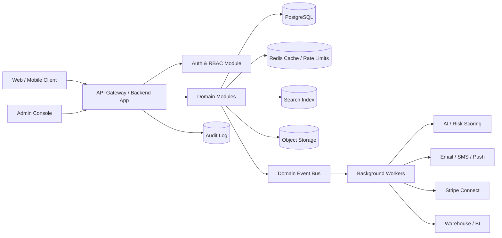
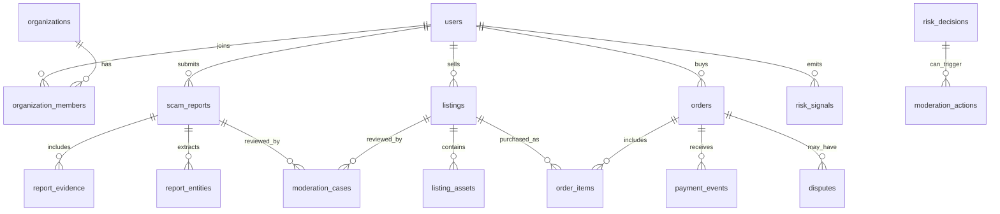
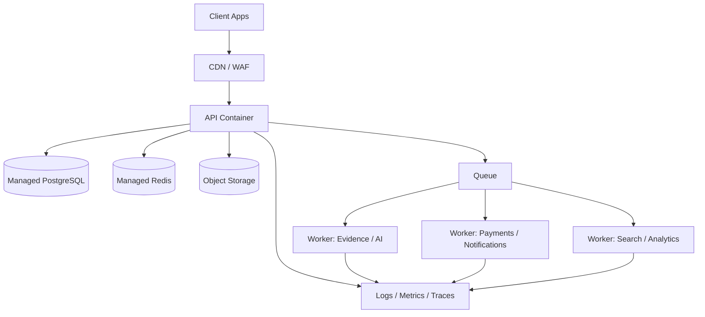

# Scam2Market Backend Implementation Plan

Date: 2026-08-08

## 1. Current Repository Assessment

The current workspace is a fresh Git repository with no application source files, no commits, and no configured remote. This plan is therefore a greenfield backend implementation plan based on the project name and expected Scam2Market product scope: a trust-centered marketplace and intelligence platform for reporting, verifying, publishing, searching, buying/selling, and operationalizing scam-related market data, services, cases, or vetted opportunities.

If the frontend/product specification already exists outside this repository, the backend modules below should be mapped to the exact screens and user journeys before implementation begins.

## 2. Product Interpretation And Backend Goal

Scam2Market should not be built as a simple CRUD marketplace. The backend must maximize trust, data quality, safety, monetization readiness, and operational scalability. The most valuable backend output will come from a platform that can:

- Accept scam reports, evidence, listings, profiles, transactions, messages, and disputes.
- Verify users, sellers, buyers, reports, and uploaded evidence.
- Score risk and trust continuously, not only at signup.
- Convert raw scam signals into searchable marketplace intelligence.
- Protect users from abuse, spam, false claims, impersonation, and unsafe business flows.
- Support payments, escrow-style milestones, refunds, disputes, subscriptions, and admin intervention.
- Provide a clean API contract for frontend, admin tools, mobile clients, and future partners.

## 3. Recommended Architecture

Use a modular monolith for the first production release, with event-driven boundaries designed from day one. This gives the speed of a single deployable backend while keeping the system ready to split into services later.

### Recommended Stack

- Runtime: Node.js with TypeScript.
- Framework: NestJS or Fastify-based service layer. NestJS is recommended if the team wants strict module boundaries, dependency injection, guards, queues, and background worker structure.
- Database: PostgreSQL.
- ORM/query layer: Prisma for developer speed, or Drizzle/Kysely if SQL control is more important.
- Cache and rate limits: Redis.
- Queue/event processing: BullMQ on Redis for MVP; migrate high-volume streams to Kafka, Redpanda, NATS, or cloud-native queues later.
- Search: PostgreSQL full-text search for MVP; OpenSearch/Meilisearch once relevance, filtering, and volume become central.
- Object storage: S3-compatible storage for evidence, attachments, documents, exports, and generated reports.
- API style: REST for app workflows, OpenAPI for contracts, webhooks for integrations, and internal domain events using CloudEvents-compatible metadata.
- Authentication: Auth.js, Clerk, WorkOS, Cognito, or a custom JWT/session stack depending on build constraints. For highest trust, prefer passkeys/MFA support and enterprise-ready identity providers.
- Payments: Stripe Connect for marketplace payments, seller payouts, platform fees, refunds, and dispute handling.
- Observability: OpenTelemetry traces, structured logs, metrics, Sentry-style error tracking, and audit logs.
- Deployment: Docker containers. Start with a single API service plus worker service. Deploy on Render/Fly/AWS ECS/GCP Cloud Run/Vercel serverless only if long-running worker constraints are handled.

### Architecture Diagram



## 4. Core Domain Segmentation

### 4.1 Identity, Accounts, And Organizations

Purpose: establish who is using the system and what they are allowed to do.

Features:

- User signup, login, email/phone verification, passkeys/MFA.
- Buyer, seller, analyst, moderator, admin, and partner roles.
- Organization accounts for agencies, firms, marketplaces, or teams.
- Account status lifecycle: pending, active, limited, suspended, banned, deleted.
- Device/session tracking, login risk signals, and account takeover detection.
- User profile trust indicators: verified identity, verified business, transaction history, report accuracy, dispute history.

Implementation notes:

- Use role-based access control for coarse permissions and attribute-based checks for resource ownership.
- Add row-level authorization checks at the service layer and consider PostgreSQL Row-Level Security for tenant-owned tables where appropriate.
- Follow current identity guidance from NIST SP 800-63-4 for authentication, identity proofing, authenticator lifecycle, and fraud-aware identity decisions.

Key tables:

- `users`
- `organizations`
- `organization_members`
- `roles`
- `permissions`
- `sessions`
- `auth_factors`
- `identity_verifications`
- `account_risk_events`

### 4.2 Scam Report Intake

Purpose: capture structured and unstructured scam information with evidence.

Features:

- Report creation with scam type, channel, amount, geography, platform, involved parties, and timeline.
- Evidence uploads: screenshots, emails, documents, links, transaction IDs, wallet addresses, phone numbers, IPs.
- Draft and submitted states.
- Duplicate report detection.
- Privacy controls for sensitive evidence.
- Reporter anonymity options where legally and operationally safe.
- Report status lifecycle: draft, submitted, triaged, needs_more_info, verified, rejected, escalated, published, archived.

Implementation notes:

- Store evidence metadata in PostgreSQL and binary files in S3-compatible object storage.
- Extract indicators of compromise and useful entities asynchronously.
- Compute a confidence score that combines evidence completeness, reporter trust, duplicate matches, AI extraction, external signals, and moderator outcome.

Key tables:

- `scam_reports`
- `report_subjects`
- `report_evidence`
- `report_entities`
- `report_status_history`
- `report_duplicate_links`

### 4.3 Marketplace Listings

Purpose: convert verified knowledge, services, tools, or opportunities into marketplace objects.

Possible listing categories:

- Verified scam intelligence reports.
- Investigation services.
- Recovery or advisory services.
- Anti-fraud software/tools.
- Datasets or watchlists.
- Educational products.
- Bounty requests or case work.

Features:

- Listing creation and seller onboarding.
- Listing verification and moderation before public availability.
- Pricing models: free, one-time purchase, subscription, quote-based, milestone-based.
- Inventory or access control for digital products.
- Ratings and reviews gated by completed transactions.
- Listing status lifecycle: draft, pending_review, active, paused, rejected, removed, sold_out.

Implementation notes:

- Keep listings separate from scam reports. A report can produce one or more derived marketplace assets, but raw reports should not automatically become sellable.
- Use content moderation and policy checks before publishing.
- Use denormalized search documents for fast browsing and filtering.

Key tables:

- `listings`
- `listing_versions`
- `listing_categories`
- `listing_assets`
- `listing_verifications`
- `listing_prices`
- `listing_reviews`

### 4.4 Trust, Verification, And Risk Engine

Purpose: make the platform defensible against manipulation.

Features:

- User trust score.
- Seller trust score.
- Listing trust score.
- Report confidence score.
- Transaction risk score.
- Evidence confidence score.
- Abuse pattern detection: fake accounts, review manipulation, spam, coordinated reporting, risky payment behavior.
- Rules engine for deterministic checks.
- AI-assisted classifier for text/image/evidence risk flags.
- Human moderation queue for ambiguous or high-impact decisions.

Implementation notes:

- Do not make AI the final authority for account bans, monetary holds, or legal claims. Use AI to prioritize, extract, summarize, and recommend.
- Store every risk decision with input signals, model/rule versions, score, and reviewer override.
- Implement a `risk_decisions` table so decisions are explainable and auditable.

Risk score inputs:

- Account age.
- Verification level.
- Device and IP reputation.
- Payment status.
- Prior disputes.
- Listing category risk.
- Report evidence completeness.
- Duplicate signal strength.
- Moderation outcome history.
- Velocity patterns.

Key tables:

- `risk_signals`
- `risk_decisions`
- `risk_rules`
- `risk_rule_versions`
- `moderation_cases`
- `moderation_actions`

### 4.5 Payments, Wallets, Fees, And Payouts

Purpose: support real marketplace monetization while reducing payment risk.

Features:

- Buyer checkout.
- Seller onboarding.
- Platform commission.
- Taxes/receipts metadata.
- Refunds.
- Chargebacks.
- Dispute status sync.
- Payout eligibility controls.
- Optional milestone release for service work.
- Subscription access for premium intelligence.

Implementation notes:

- Use Stripe Connect rather than building payout infrastructure manually.
- For one seller per purchase, use destination charges when suitable.
- For multi-party or delayed payout flows, use separate charges and transfers.
- Never rely only on frontend payment success. Webhooks must be the source of truth.
- Every external payment event should be idempotently processed.

Key tables:

- `orders`
- `order_items`
- `payment_intents`
- `payment_events`
- `transfers`
- `refunds`
- `chargebacks`
- `seller_payout_accounts`
- `platform_fees`

### 4.6 Messaging And Collaboration

Purpose: allow controlled buyer-seller, reporter-moderator, and case-team communication.

Features:

- Conversations tied to listings, orders, reports, disputes, or support cases.
- File attachments with malware/content checks.
- Message moderation and abuse reporting.
- Internal admin notes.
- Optional masked contact details.
- Read receipts and notification triggers.

Implementation notes:

- Keep direct user contact details hidden by default to reduce off-platform fraud.
- Use event-based notifications for new messages and status changes.
- Add policy checks for prohibited content, phishing links, payment circumvention, and harassment.

Key tables:

- `conversations`
- `conversation_members`
- `messages`
- `message_attachments`
- `message_flags`

### 4.7 Disputes, Support, And Case Management

Purpose: handle failures, conflicts, and high-trust workflows.

Features:

- Buyer dispute creation.
- Seller response flow.
- Evidence submission.
- Moderator assignment.
- SLA timers.
- Outcome actions: refund, partial refund, payout release, account warning, listing removal.
- Support tickets unrelated to payments.

Implementation notes:

- Build disputes as state machines, not loose status strings.
- Use append-only events for dispute history.
- Keep admin actions auditable and reversible when possible.

Key tables:

- `disputes`
- `dispute_events`
- `dispute_evidence`
- `support_tickets`
- `support_comments`
- `admin_actions`

### 4.8 Search, Discovery, And Intelligence Graph

Purpose: turn scam-related information into useful, searchable, monetizable data.

Features:

- Search reports, listings, sellers, categories, indicators, phone numbers, emails, domains, wallet addresses, platform names, and geography.
- Faceted filters by scam type, risk score, confidence, price, category, region, date, verification level.
- Similar scam detection.
- Entity graph: connect reports, listings, accounts, indicators, evidence, and transactions.
- Saved searches and alerts.

Implementation notes:

- Start with PostgreSQL full-text search and trigram indexes for MVP.
- Introduce OpenSearch/Meilisearch when ranking, typo tolerance, and analytics become important.
- Use graph-shaped relational tables first. Introduce Neo4j or a graph database only when traversal depth and graph queries become core product features.

Key tables:

- `search_documents`
- `saved_searches`
- `entity_nodes`
- `entity_edges`
- `indicator_observations`

### 4.9 Notifications

Purpose: keep users and operators informed without creating spam or leaking sensitive information.

Channels:

- Email.
- SMS.
- Push.
- In-app notification feed.
- Webhooks for partners.

Events:

- Report status changed.
- Listing approved/rejected.
- Order paid.
- Seller payout ready.
- Dispute opened.
- Moderator requested more info.
- Saved search matched a new verified signal.
- Risk hold applied.

Implementation notes:

- Use notification preferences per user and organization.
- Queue all outbound notifications.
- Store notification delivery attempts and provider responses.
- Avoid sensitive evidence or personally identifiable information in notification bodies.

Key tables:

- `notifications`
- `notification_preferences`
- `notification_deliveries`
- `webhook_endpoints`
- `webhook_deliveries`

### 4.10 Admin, Moderation, And Operations

Purpose: give operators enough power to keep the marketplace healthy.

Features:

- Moderator queues by priority, category, and SLA.
- Report verification workspace.
- Listing review workspace.
- User/account risk console.
- Payment/dispute console.
- Audit log search.
- Feature flags and policy configuration.
- Manual risk overrides.
- Data export and takedown tools.

Implementation notes:

- Admin APIs require stricter RBAC, MFA, session re-authentication for destructive actions, and immutable audit logs.
- Every admin action should record actor, target, before/after values, reason, IP/device, and request ID.

Key tables:

- `audit_logs`
- `admin_notes`
- `policy_rules`
- `feature_flags`
- `moderation_queues`

### 4.11 Analytics And Reporting

Purpose: measure business output, trust quality, fraud exposure, and operational throughput.

Metrics:

- Report submission volume.
- Report verification rate.
- Duplicate detection rate.
- Listing approval rate.
- Conversion rate.
- Gross merchandise value.
- Platform revenue.
- Dispute rate.
- Refund/chargeback rate.
- Moderator SLA.
- Risk false positive and false negative rates.
- Search-to-purchase conversion.
- Saved-search alert engagement.

Implementation notes:

- Emit analytics events from the backend, not only the frontend.
- Build an event taxonomy early.
- Move events to a warehouse once volume justifies it.

Key tables:

- `analytics_events`
- `metric_snapshots`
- `reporting_exports`

## 5. Data Architecture

### 5.1 Database Strategy

PostgreSQL should be the system of record. Use UUID or ULID primary keys. Use explicit state machines for workflows. Avoid hard-deleting operational data; prefer soft delete plus retention policies.

Core principles:

- Normalize transactional data.
- Denormalize read/search projections.
- Use database constraints for critical invariants.
- Add idempotency keys for external requests and webhooks.
- Use optimistic locking or version columns for contested updates.
- Encrypt highly sensitive fields at the application layer if required.
- Separate raw evidence from public/searchable derived data.

### 5.2 Initial High-Level Entity Map



### 5.3 Event Model

Use domain events for workflow transitions and side effects. Event payloads should include stable metadata inspired by CloudEvents:

- `id`
- `type`
- `source`
- `subject`
- `time`
- `actor_id`
- `correlation_id`
- `idempotency_key`
- `schema_version`
- `data`

Example event types:

- `user.registered`
- `identity.verification.completed`
- `report.submitted`
- `report.verified`
- `listing.submitted_for_review`
- `listing.approved`
- `order.payment_succeeded`
- `risk.hold_applied`
- `dispute.opened`
- `moderation.action_recorded`

## 6. API Design

### 6.1 API Standards

- Version all public APIs under `/api/v1`.
- Generate OpenAPI documentation.
- Use request IDs and correlation IDs.
- Require idempotency keys on payment/order/report mutation endpoints.
- Return consistent error shapes.
- Validate every request body with schemas.
- Apply pagination defaults and maximum limits.
- Do not expose internal risk details that attackers can use to tune abuse.

### 6.2 Proposed Endpoint Groups

Identity:

- `POST /api/v1/auth/register`
- `POST /api/v1/auth/login`
- `POST /api/v1/auth/logout`
- `GET /api/v1/me`
- `PATCH /api/v1/me`
- `POST /api/v1/me/mfa`

Reports:

- `POST /api/v1/reports`
- `GET /api/v1/reports`
- `GET /api/v1/reports/:id`
- `PATCH /api/v1/reports/:id`
- `POST /api/v1/reports/:id/submit`
- `POST /api/v1/reports/:id/evidence`
- `GET /api/v1/reports/:id/status-history`

Listings:

- `POST /api/v1/listings`
- `GET /api/v1/listings`
- `GET /api/v1/listings/:id`
- `PATCH /api/v1/listings/:id`
- `POST /api/v1/listings/:id/submit`
- `POST /api/v1/listings/:id/pause`
- `POST /api/v1/listings/:id/reviews`

Orders and payments:

- `POST /api/v1/orders`
- `GET /api/v1/orders`
- `GET /api/v1/orders/:id`
- `POST /api/v1/orders/:id/checkout`
- `POST /api/v1/orders/:id/refund-request`
- `POST /api/v1/webhooks/stripe`

Messaging:

- `GET /api/v1/conversations`
- `POST /api/v1/conversations`
- `GET /api/v1/conversations/:id/messages`
- `POST /api/v1/conversations/:id/messages`

Disputes:

- `POST /api/v1/disputes`
- `GET /api/v1/disputes`
- `GET /api/v1/disputes/:id`
- `POST /api/v1/disputes/:id/evidence`
- `POST /api/v1/disputes/:id/respond`

Search:

- `GET /api/v1/search`
- `POST /api/v1/saved-searches`
- `GET /api/v1/saved-searches`
- `DELETE /api/v1/saved-searches/:id`

Admin:

- `GET /api/v1/admin/moderation-cases`
- `POST /api/v1/admin/moderation-cases/:id/assign`
- `POST /api/v1/admin/moderation-cases/:id/decision`
- `GET /api/v1/admin/users/:id/risk`
- `POST /api/v1/admin/users/:id/actions`
- `GET /api/v1/admin/audit-logs`

## 7. Security Architecture

Security should be treated as a product feature because the platform itself deals with scams, money, evidence, and trust.

### 7.1 Required Controls

- Strong authentication with MFA/passkey option.
- Short-lived access tokens and refresh-token rotation, or secure server sessions.
- RBAC plus ownership checks on every endpoint.
- Central authorization utilities tested independently.
- Rate limits per IP, user, org, endpoint, and sensitive business flow.
- Bot and fake-account defenses at signup, listing creation, report submission, checkout, messaging, and review creation.
- Input validation and output filtering.
- File upload scanning and content-type validation.
- Signed object-storage URLs with expiry.
- Secrets stored in a managed secret store.
- Immutable audit logs for admin and payment actions.
- CSRF protection if cookie-based sessions are used.
- Webhook signature verification.
- Idempotency on all payment, payout, and moderation mutation flows.

### 7.2 OWASP API Risk Mapping

Backend design should explicitly address the OWASP API Security Top 10 2023:

- Broken object-level authorization: centralized ownership/resource checks.
- Broken authentication: MFA, token/session hardening, device risk tracking.
- Broken object property-level authorization: DTO-level allowlists for reads and writes.
- Unrestricted resource consumption: quotas, upload limits, Redis-backed rate limits, worker budgets.
- Broken function-level authorization: route guards and policy tests.
- Unrestricted access to sensitive business flows: bot controls and velocity limits on signup, report submission, checkout, reviews, and messages.
- SSRF: strict URL fetch allowlists and isolated evidence-fetch workers.
- Security misconfiguration: hardened headers, CORS policy, IaC checks.
- Improper inventory management: OpenAPI inventory and endpoint ownership.
- Unsafe consumption of APIs: timeouts, retries, circuit breakers, schema validation, webhook verification.

## 8. AI And Automation Layer

AI should increase moderation throughput and intelligence extraction while leaving irreversible decisions auditable and human-reviewable.

### 8.1 AI Use Cases

- Summarize scam reports for moderators.
- Extract entities: phone numbers, emails, domains, payment handles, wallet addresses, company names, URLs.
- Classify scam type.
- Identify duplicate reports.
- Flag suspicious listings or messages.
- Generate search tags.
- Produce buyer-friendly intelligence summaries from verified reports.
- Suggest risk decisions with explanations.

### 8.2 AI Safety Rules

- Store model name/version, prompt version, input references, output, and confidence.
- Keep sensitive evidence access-controlled.
- Review AI output before publishing user-impacting claims.
- Use moderation models for harmful or unsafe content detection.
- Do not expose internal risk explanations to suspicious users.

Key tables:

- `ai_jobs`
- `ai_extractions`
- `ai_classifications`
- `ai_summaries`
- `model_versions`

## 9. Background Workers

Workers should handle slow, unreliable, or expensive tasks:

- Evidence processing.
- Thumbnail generation.
- OCR.
- Entity extraction.
- AI classification.
- Duplicate detection.
- Search indexing.
- Stripe webhook processing.
- Notification sending.
- Report/listing moderation queue assignment.
- Risk recalculation.
- Analytics rollups.
- Data export generation.

Worker design:

- All jobs have retries with backoff.
- All jobs are idempotent.
- Poison jobs are moved to a dead-letter queue.
- Job payloads contain references, not large binary content.
- Track job attempts and failure reasons.

## 10. Performance And Scale Plan

### MVP Targets

- API p95 latency under 300 ms for normal reads.
- API p95 latency under 700 ms for standard writes.
- Evidence uploads through direct-to-storage signed URLs.
- Background processing for AI/OCR/search indexing.
- Search result p95 under 500 ms for common filters.
- Webhook processing idempotent and under provider timeout limits.

### Scaling Path

Phase 1:

- Single API service.
- Single worker service.
- PostgreSQL.
- Redis.
- Object storage.

Phase 2:

- Separate read models for marketplace/search.
- Dedicated worker pools by job type.
- Read replicas for analytics-heavy reads.
- OpenSearch/Meilisearch.
- CDN for public assets.

Phase 3:

- Split high-volume modules into services: payments, search, risk, notifications.
- Event streaming platform.
- Dedicated analytics warehouse.
- Multi-region read strategy if needed.

## 11. Compliance, Privacy, And Data Governance

Because scam reports may contain personal data, financial information, and allegations, the backend should include privacy controls from the start.

Required practices:

- Data classification for every table/field.
- Evidence access logs.
- Retention rules for raw evidence.
- User data export and deletion workflows.
- Takedown and correction workflow.
- Legal hold workflow.
- Public/private field separation.
- Consent and terms version tracking.
- Sensitive field redaction for logs, analytics, and notifications.

Sensitive data categories:

- Identity data.
- Contact data.
- Payment references.
- Uploaded evidence.
- Alleged scammer identifiers.
- Private messages.
- Device/IP/session metadata.

## 12. Testing Strategy

Test coverage should follow risk:

- Unit tests for policies, state machines, pricing, fees, and risk rules.
- Integration tests for every module service and database interaction.
- Contract tests for OpenAPI endpoints.
- Webhook replay tests for Stripe and notification providers.
- Authorization matrix tests for buyer, seller, reporter, moderator, admin, and organization users.
- File upload security tests.
- Rate-limit tests.
- End-to-end tests for report submission, listing approval, checkout, dispute, refund, and admin moderation.
- Load tests for search, report intake, checkout, and webhooks.

Critical flows that must not ship without tests:

- User cannot access another user's private report/evidence/order.
- Seller cannot approve their own listing.
- Buyer cannot mark payment complete without webhook confirmation.
- Duplicate webhook events do not double-create orders, refunds, transfers, or notifications.
- Suspended users cannot list, message, purchase, or withdraw.
- Admin actions are audit logged.

## 13. Implementation Roadmap

### Phase 0: Product And Technical Foundation

Duration: 3-5 days.

Deliverables:

- Confirm product scope and user roles.
- Decide stack.
- Create repo structure.
- Configure TypeScript, linting, formatting, tests, Docker, environment validation.
- Create OpenAPI baseline.
- Set up CI.
- Define coding standards and module boundaries.

### Phase 1: Core Platform Foundation

Duration: 1-2 weeks.

Deliverables:

- Auth module.
- User and organization module.
- RBAC/authorization service.
- PostgreSQL schema and migrations.
- Audit log module.
- Redis integration.
- Rate limiting.
- File upload signed URL flow.
- Background worker foundation.
- Domain event table/outbox pattern.

### Phase 2: Scam Report Intake And Evidence Processing

Duration: 2-3 weeks.

Deliverables:

- Report CRUD and submission workflow.
- Evidence upload and metadata.
- Report state machine.
- Entity extraction job skeleton.
- Duplicate detection baseline.
- Moderator report queue.
- Report status history.
- Privacy and access controls.

### Phase 3: Marketplace Listings And Search

Duration: 2-3 weeks.

Deliverables:

- Listing CRUD and review workflow.
- Listing assets and prices.
- Category/taxonomy module.
- Public listing search and filters.
- Listing moderation queue.
- Search projection/indexing jobs.
- Saved searches.

### Phase 4: Payments And Orders

Duration: 2-3 weeks.

Deliverables:

- Seller payout onboarding.
- Orders and checkout.
- Stripe Connect integration.
- Webhook processing.
- Platform fees.
- Refunds baseline.
- Payment audit trail.
- Payout hold/risk controls.

### Phase 5: Messaging, Disputes, And Support

Duration: 2-3 weeks.

Deliverables:

- Conversations and messages.
- Attachment controls.
- Abuse reporting.
- Dispute state machine.
- Dispute evidence.
- Moderator/admin resolution tools.
- Notification triggers.

### Phase 6: Risk Engine And AI Automation

Duration: 3-5 weeks.

Deliverables:

- Risk signal ingestion.
- Risk scoring service.
- Rules engine.
- AI extraction/classification/summarization jobs.
- Moderation recommendations.
- Risk hold workflows.
- Risk dashboard endpoints.
- False-positive/false-negative review process.

### Phase 7: Admin Console APIs And Operational Hardening

Duration: 2-3 weeks.

Deliverables:

- Admin moderation APIs.
- User/account actions.
- Audit log search.
- Feature flags.
- Policy configuration.
- SLA queues.
- Reporting endpoints.
- Support tools.

### Phase 8: Production Readiness

Duration: 1-2 weeks.

Deliverables:

- Load testing.
- Security review.
- Backup and restore test.
- Disaster recovery runbook.
- Monitoring dashboards.
- Alerting.
- Error budgets.
- Incident response playbooks.
- Launch checklist.

## 14. Recommended Repository Structure

```text
src/
  main.ts
  app.module.ts
  config/
  common/
    authz/
    errors/
    logging/
    validation/
    pagination/
    idempotency/
  modules/
    auth/
    users/
    organizations/
    reports/
    evidence/
    listings/
    search/
    orders/
    payments/
    messaging/
    disputes/
    moderation/
    risk/
    notifications/
    analytics/
    admin/
  workers/
    index.ts
    jobs/
  events/
    event-bus.ts
    outbox.ts
  db/
    migrations/
    seed/
    schema/
  integrations/
    stripe/
    openai/
    email/
    sms/
    storage/
test/
  unit/
  integration/
  e2e/
docs/
  api/
  architecture/
```

## 15. Deployment Architecture



Production environments:

- `development`
- `staging`
- `production`

Required environment practices:

- Separate databases per environment.
- Separate Stripe accounts or modes.
- Separate object-storage buckets.
- Environment-specific secrets.
- Migration checks before deploy.
- Rollback plan for code and schema.

## 16. Prioritized MVP Backend Scope

The strongest MVP should prove the trust loop, not every advanced feature.

Build first:

1. Auth, roles, users, organizations.
2. Report intake with evidence.
3. Listing creation and moderation.
4. Public marketplace search.
5. Orders and Stripe checkout.
6. Basic dispute workflow.
7. Admin moderation.
8. Audit logs.
9. Risk scoring v1.
10. Notifications.

Defer until after MVP:

- Full graph database.
- Complex AI model training.
- Multi-region architecture.
- Partner API marketplace.
- Advanced seller analytics.
- Automated legal/takedown workflows.
- Native mobile push unless mobile app is already planned.

## 17. Research-Based Design References

The plan uses the following current references and implementation guidance:

- OWASP API Security Top 10 2023: https://owasp.org/API-Security/editions/2023/en/0x04-release-notes/
- OWASP API Security project: https://owasp.org/www-project-api-security/
- NIST SP 800-63-4 Digital Identity Guidelines, published 2025-08-01: https://www.nist.gov/publications/nist-sp-800-63-4-digital-identity-guidelines
- NIST SP 800-63-4 online guidance: https://pages.nist.gov/800-63-4/
- Stripe Connect charge type guidance: https://docs.stripe.com/connect/charges
- Stripe separate charges and transfers: https://docs.stripe.com/connect/separate-charges-and-transfers
- PostgreSQL Row-Level Security documentation: https://www.postgresql.org/docs/current/ddl-rowsecurity.html
- Redis rate limiting guidance: https://redis.io/docs/latest/develop/use-cases/rate-limiter/
- CloudEvents specification: https://github.com/cloudevents/spec
- AWS Well-Architected Reliability Pillar: https://docs.aws.amazon.com/wellarchitected/latest/reliability-pillar/welcome.html
- OpenAI Moderation API reference: https://platform.openai.com/docs/api-reference/moderations

## 18. Immediate Next Actions

1. Confirm exact product definition: marketplace for scam intelligence, anti-scam services, recovery services, datasets, or another business model.
2. Create backend project scaffold.
3. Choose final stack: NestJS + PostgreSQL + Redis + BullMQ + Prisma is the recommended default.
4. Define user roles and first 10 core user journeys.
5. Produce the database schema v1 and OpenAPI v1.
6. Implement Phase 1 foundation before adding marketplace complexity.
