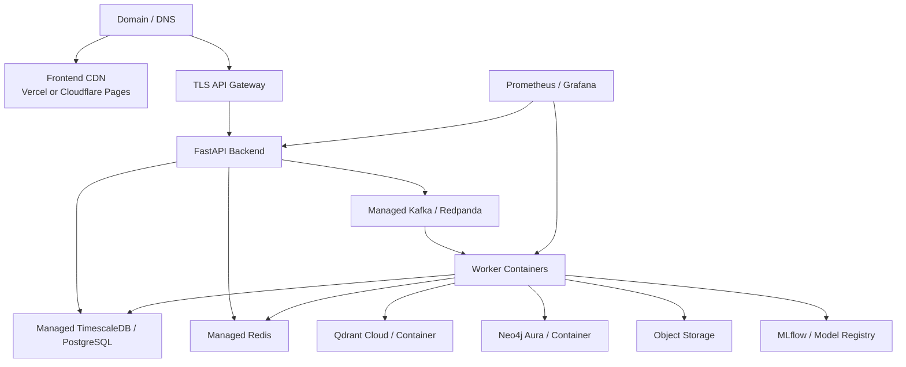

# Future Enhancements And Hosting Strategy

This document describes the remaining product, intelligence, operations, and deployment work for Scam2Market after the current backend implementation. It is written as an execution roadmap for turning the present backend into a hosted analyst product.

## Executive Summary

The backend is ready for frontend integration and deterministic local demonstrations. The strongest next investment is not more generic backend scaffolding; it is completing production evidence acquisition, hardening live connectors, adding analyst-facing verification views, and deploying the stack into a real managed environment.

The most important reminder remains:

> Phase 8 backend implementation is complete with configurable RSS/Atom, GitHub Releases, and SEC EDGAR connectors, governed source policies, connector/version tracking, and analyst verification APIs. Production source registration, credentials, licensed-provider agreements, retention/attribution decisions, additional regulator-specific connectors, and sustained operational validation remain deployment work.

## Roadmap Priorities

| Priority | Workstream | Outcome |
|---|---|---|
| P0 | Phase 8 production onboarding | Register approved official sources and validate trustworthy event-time evidence under sustained operation. |
| P0 | Frontend integration contract | Analyst dashboard consumes stable backend APIs without relying on mock data. |
| P0 | Live provider hardening | Exchange/social feeds survive reconnects, rate limits, gaps, and provider outages. |
| P0 | Hosted staging | Backend, workers, database, Redis, streaming, and observability run outside local Docker. |
| P1 | Portfolio intelligence | Tenants can monitor watchlists, holdings, exposure, and cross-asset risk. |
| P1 | SIEM and case-management integrations | Alerts and signed evidence can flow into enterprise security/compliance tooling. |
| P1 | Model quality loop | Analyst labels, false-positive reports, drift, calibration, and promotion become routine. |
| P2 | Cross-platform entity intelligence | Shared promoters, URLs, wallets, accounts, and narratives link campaigns over time. |
| P2 | Adversarial simulation | The team can test manipulation variants before adversaries exploit blind spots. |

## P0: Operate Phase 8 Official-Source Verification

### Goal

Onboard and validate the implemented source-backed claim-verification system in a production environment.

### Implementation Plan

1. Register and validate official disclosure connectors.
   - Exchange announcements: Binance, Coinbase, Kraken, OKX, Bybit, KuCoin, Gate.io where policy allows.
   - Regulator disclosures: SEC EDGAR for public-company disclosures, CFTC/FINRA notices where relevant, regional regulator feeds where supported.
   - Project-owned sources: official project blogs, GitHub release feeds, status pages, governance forums, and verified social channels.
   - Reliable news: RSS or licensed APIs from reputable market/news providers.

2. Configure source trust and policy administration.
   - Tables: `source_policies`, `source_trust_scores`, `source_license_rules`, `source_connector_runs`, `source_document_versions`.
   - Fields: source type, trust level, retention class, allowed usage, crawl cadence, dedup key, canonical URL, first-seen time, published time, retrieved time, and signature/hash metadata.
   - API: create/update source policy, disable source, inspect source lag, inspect rejected documents, and audit source-policy changes.

3. Integrate the analyst-facing verification APIs into the full frontend.
   - API: `GET /api/v1/claims/{claim_id}`, `GET /api/v1/claims/{claim_id}/verification`, `GET /api/v1/alerts/{alert_id}/claims`, `GET /api/v1/disclosures/{document_id}`.
   - Response should include extracted claim, verification outcome, supporting documents, conflicting documents, cutoff time, retrieval query, source trust, and whether evidence was available before the alert.

4. Continuously validate strict temporal-leakage controls.
   - Retrieval must filter by `published_at <= alert_time` unless the analyst explicitly requests retrospective analysis.
   - Store both `published_at` and `retrieved_at`.
   - Tests must prove future documents cannot support past alerts.

5. Add deterministic-first summarization.
   - LLM summaries should summarize retrieved evidence only after deterministic filtering.
   - Store prompt template version, model version, retrieved document IDs, and redaction/guardrail results.
   - If the LLM fails, verification outcome must still be computed deterministically.

### Acceptance Criteria

- Every HIGH/CRITICAL alert with a narrative claim has a claim-verification status.
- Analysts can see whether each claim was supported before alert time.
- Future documents cannot reduce a past alert's risk.
- Source outages degrade verification confidence without blocking baseline scoring.
- Evidence records include source IDs, timestamps, hashes, and retrieval metadata.

## P0: Frontend Integration And API Completion

### Goal

Build a frontend that connects to the backend without mock answers.

### Recommended Frontend Workflows

- Login and tenant selection.
- Watchlist and portfolio landing view.
- Asset overview with latest score, market state, social state, data freshness, and campaign status.
- Alert queue with filters, severity, stage, acknowledgement state, assignment, and SLA.
- Alert detail with evidence snapshot, explanation, dominant narrative, verification status, and timeline.
- Campaign detail with stage history, related alerts, graph view, and replay links.
- Investigation workspace with notes, events, feedback, tags, and exports.
- Operations page with source health, worker checkpoints, model drift, policy proposals, and readiness.

### Implementation Notes

- Generate a typed client from `contracts/openapi-v1.json`.
- Treat SSE/WebSocket streams as enhancement paths; the UI should also poll alert lists for recovery.
- Use dev auth only locally. Production should use OIDC/JWT.
- Avoid hardcoding demo asset IDs; drive the UI from watchlists and API results.
- Add contract tests that boot the backend and validate the frontend client against representative responses.

## P0: Live Exchange And Social Provider Hardening

### Exchange Providers

Add production-grade connectors with:

- websocket reconnect and REST backfill;
- source sequence validation;
- timestamp normalization;
- rate-limit budget accounting;
- gap detection and degraded quality state;
- per-symbol cursor persistence;
- replay parity tests comparing captured raw events to normalized output.

Recommended providers:

- Binance public market data for low-cost early validation.
- Coinbase/Kraken public market feeds for redundancy.
- CCXT-style adapters only for normalized REST use, not as the sole websocket reliability layer.

### Social And News Providers

Add connectors with:

- deletion and retention policy handling;
- author pseudonymization before persistence;
- source-specific rate limits;
- raw event archiving rules;
- source trust labels;
- legal/licensing review before production use.

Recommended low-cost sources:

- Mastodon public timelines for open social test data.
- RSS feeds for project blogs, exchange announcements, and news sources.
- GitHub releases and project status pages for official-source claims.

## P0: Hosted Staging Deployment

### Recommended Architecture



### Where To Deploy The Frontend

Use Vercel, Netlify, or Cloudflare Pages.

Vercel is a strong choice for the frontend because it offers:

- simple GitHub integration;
- preview deployments per branch/PR;
- environment variables for API base URLs;
- automatic HTTPS;
- generous free-tier usage for small projects.

Recommended frontend environment variables:

```env
NEXT_PUBLIC_API_BASE_URL=https://api.your-domain.example
NEXT_PUBLIC_ALERT_STREAM_URL=https://api.your-domain.example/api/v1/stream/alerts
NEXT_PUBLIC_WS_ALERT_URL=wss://api.your-domain.example/api/v1/ws/alerts
```

### Where To Deploy The Backend

Do not deploy the full backend as Vercel serverless functions. The backend has long-running workers, Kafka consumers, database migrations, WebSockets, SSE, and dependency-heavy services. It should run on a container platform.

Good early options:

- Render web service plus background workers.
- Railway services for API and workers.
- Fly.io machines for API/workers close to managed data services.
- Azure Container Apps or Google Cloud Run jobs/services for containerized deployment.
- AWS ECS or EKS when moving toward the included Terraform/Helm production design.

Minimum hosted backend process groups:

- `api`
- `feature-worker`
- `intelligence-worker`
- `campaign-worker`
- `realtime-worker`
- `notification-worker`
- `evidence-worker`
- `archive-worker`
- `replay-control-worker`
- optional `narrative-worker`
- optional `verification-worker`

### Where To Deploy The Model

The current backend uses deterministic detectors, calibration artifacts, and MLflow metadata. Future learned models can be deployed in one of three patterns:

1. In-process model artifact loading.
   - Best for simple calibrated models and fast inference.
   - Store artifacts in S3/R2 and load by governed alias.

2. Internal model service.
   - Best when models require separate dependencies or GPU/large CPU allocations.
   - Expose a private HTTP/gRPC endpoint reachable only by backend workers.

3. Batch/shadow scorer.
   - Best for challenger models and offline evaluation.
   - Writes `shadow_scores` and never controls alerts until promotion gates pass.

Recommended first production approach: keep calibrated baseline models in-process, use MLflow for registry metadata, and introduce a separate model service only when model size or runtime justifies it.

## Free And Low-Cost Online Service Options

Free-tier limits change over time, so verify provider terms before committing the architecture. The following is a practical low-cost starting map.

| Need | Free/Low-Cost Option | Notes |
|---|---|---|
| Frontend hosting | Vercel, Netlify, Cloudflare Pages | Usually easiest and cheapest for static or Next.js dashboard hosting. |
| Backend API | Render free/trial, Railway credits, Fly.io allowances, Google Cloud Run free tier | Free containers may sleep; background workers may require paid plans. |
| PostgreSQL | Neon, Supabase, Render Postgres trial/free | Good for dev/staging; production TimescaleDB may require Tiger Cloud or self-hosting. |
| TimescaleDB | Tiger Cloud trial/free tier where available, self-host TimescaleDB on a VM | Required if using Timescale-specific features in production. |
| Redis | Upstash Redis free tier, Redis Cloud free tier | Good for rate limits and latest state; stream throughput limits must be checked. |
| Kafka/Redpanda | Upstash Kafka free tier, Aiven/Confluent trials, self-host Redpanda | Kafka-compatible streaming is central; self-hosting is often cheaper but operationally heavier. |
| Qdrant | Qdrant Cloud free tier or container | Optional; deterministic baseline can run without it. |
| Neo4j | Neo4j Aura free tier or container | Optional graph enrichment; use after baseline detection is stable. |
| MLflow | Self-hosted MLflow container, DagsHub, local artifact mode | Use low-cost object storage for artifacts. |
| Object storage | Cloudflare R2 free tier, Backblaze B2, AWS S3 low-volume | Needed for raw archives, backups, signed exports, and model artifacts. |
| Email | Resend, Brevo, SendGrid free tiers | Watch sending limits and domain verification. |
| Webhooks | Native backend delivery | No extra cost unless destination service charges. |

### Free-Tier Warning

A fully reliable production surveillance backend is unlikely to stay entirely free because it needs always-on workers, persistent streaming, database storage, observability retention, and backup storage. The realistic free path is a demo/staging environment with reduced data volume and optional services disabled.

## Deployment Steps For A Domain

### 1. Register Domains

Recommended split:

- Frontend: `https://scam2market.your-domain.example`
- API: `https://api.scam2market.your-domain.example`
- Optional Grafana: private-only or VPN-protected, not public by default.

### 2. Deploy Frontend To Vercel

1. Connect the GitHub frontend repository to Vercel.
2. Set `NEXT_PUBLIC_API_BASE_URL` to the hosted API domain.
3. Set allowed production domains in the frontend auth provider.
4. Deploy from `main` after backend staging is reachable.

### 3. Deploy Backend Containers

1. Publish the backend image through the existing CD workflow to GHCR.
2. Create a backend environment file from `.env.production.example`.
3. Store secrets in the hosting provider secret manager.
4. Run migrations before starting workers.
5. Start API first, then workers, then replay validation.
6. Check `/api/v1/ready`, `/api/v1/metrics`, and a deterministic replay.

### 4. Configure Managed Data Services

Required:

- PostgreSQL/TimescaleDB URL.
- Redis URL.
- Kafka/Redpanda bootstrap servers with TLS.
- Object storage bucket for raw archive, backups, and model artifacts.

Optional but recommended:

- Qdrant URL and API key.
- Neo4j URI and password.
- MLflow tracking URI.
- OTLP endpoint.

### 5. Set CORS And Auth

```env
ALLOWED_ORIGINS=https://scam2market.your-domain.example
AUTH_REQUIRED=true
DEVELOPMENT_AUTH_ENABLED=false
OIDC_ISSUER=https://your-auth-provider.example
OIDC_AUDIENCE=scam2market-api
OIDC_JWKS_URL=https://your-auth-provider.example/.well-known/jwks.json
```

### 6. Configure TLS

Single-host Compose can use Caddy through `docker-compose.production.yml`.

Kubernetes/AWS can use ACM certificates and the Helm ingress values.

Do not expose PostgreSQL, Redis, Kafka, Neo4j, Qdrant, MLflow, Prometheus, or Grafana directly to the public internet.

### 7. Validate Production Readiness

Run:

```powershell
python scripts/validate_operations.py
python scripts/verify_release.py
```

Then verify:

- `/api/v1/health` returns OK.
- `/api/v1/ready` reports required dependencies healthy.
- Prometheus can scrape metrics.
- Grafana dashboards show request volume and dependency health.
- Backup job completes.
- Restore drill succeeds against a restore-only database.
- Replay scenario produces expected alerts.

## Additional High-Value Services

### Slack, Teams, Email, And Webhooks

Status: implemented.

Next improvements:

- quiet hours;
- escalation policies;
- per-watchlist notification thresholds;
- delivery analytics;
- dead-letter inspection API;
- notification templates per alert taxonomy.

### Portfolio Intelligence

Goal: prioritize manipulation risk by exposure and watchlist relevance.

Implementation:

- Add `portfolios`, `portfolio_positions`, `portfolio_exposure_snapshots`, and `portfolio_risk_summaries`.
- Allow CSV upload or broker/custodian integrations later.
- Compute exposure-weighted alert priority.
- Add daily/weekly risk summaries.
- Surface portfolio impact in alert details.

### Cross-Platform Entity Resolution

Goal: link actors, URLs, domains, wallet addresses, hashtags, and repeated amplifiers across campaigns without exposing raw identities.

Implementation:

- Add resolver versions and confidence-scored identity candidates.
- Use privacy-preserving hashes for raw handles.
- Combine shared URL, timing, text similarity, repost patterns, and graph neighborhood overlap.
- Require analyst confirmation for high-impact merges.
- Store merge/split audit history.

### Historical Campaign Matching

Goal: detect when a new campaign resembles previous manipulation patterns.

Implementation:

- Store campaign fingerprints using feature trajectories, narrative embeddings, graph motifs, and alert sequences.
- Index fingerprints in Qdrant or PostgreSQL vector extensions.
- Add `similar_campaigns` API on campaign detail.
- Use matches to explain recurrence and support analyst triage.

### Adversarial Simulation

Goal: test detector robustness against manipulated inputs.

Implementation:

- Add scenario templates for delayed market data, duplicated posts, hashtag flooding, narrative poisoning, organic news shocks, and stealth amplification.
- Add mutation operators for event time, author concentration, URL reuse, and claim support.
- Compare detector lead time, false positives, and evidence completeness across variants.
- Run scheduled adversarial regression in CI or nightly jobs.

### Signed Evidence Exports

Goal: produce portable evidence packages for compliance, legal review, or incident response.

Implementation:

- Export alert evidence as JSON and PDF.
- Include manifest hash, evidence snapshot hash, source document hashes, retrieval metadata, and chain-of-custody history.
- Sign exports with KMS or an offline signing key.
- Add verification CLI to validate signatures and hashes.

### SIEM Integration

Goal: route high-confidence alerts into enterprise monitoring systems.

Implementation:

- Add destination adapters for Splunk HEC, Elastic, Sentinel, Chronicle, and generic CEF/JSON webhook.
- Map alert taxonomy to severity and event categories.
- Include tenant, asset, campaign, evidence snapshot, and trace IDs.
- Add replay-safe idempotency keys.

### Vulnerability Scanning

Goal: make release security posture visible.

Implementation:

- Add Dependabot for Python, Docker, GitHub Actions, Terraform, and Helm dependencies.
- Add Trivy or Grype scanning in CI.
- Fail release on critical vulnerabilities without approved exceptions.
- Upload SARIF reports to GitHub code scanning.
- Add secret scanning and branch protection rules.

### Automated Dependency Updates

Goal: keep dependencies fresh without destabilizing the pipeline.

Implementation:

- Configure grouped Dependabot updates.
- Require CI, replay regression, migration checks, and operations validation.
- Use weekly cadence for application dependencies and monthly cadence for infrastructure providers.
- Document dependency exception process.

## Suggested Next Build Sequence

1. Register approved Phase 8 sources and validate the analyst verification APIs in staging.
2. Build the frontend against `contracts/openapi-v1.json` and local Docker backend.
3. Deploy frontend to Vercel and backend to a low-cost container host.
4. Connect managed PostgreSQL/TimescaleDB, Redis, and Kafka/Redpanda.
5. Enable OIDC, CORS, TLS, backups, and observability.
6. Add portfolio intelligence and signed evidence exports.
7. Add SIEM integration, vulnerability scanning, and automated dependency updates.
8. Add entity resolution, historical campaign matching, and adversarial simulation.

## Definition Of Done For Public Demo

- Frontend connects to hosted backend without mock responses.
- Deterministic replay can be launched and inspected from the UI.
- Alerts stream in real time.
- Evidence snapshots and explanations are visible for every HIGH/CRITICAL alert.
- Auth is enabled and development auth is disabled.
- Data services are private.
- Backups and restore drills are configured.
- CI/CD publishes the same image digest that staging runs.
- README documents environment-owned source onboarding, licensing, and connector coverage honestly.
