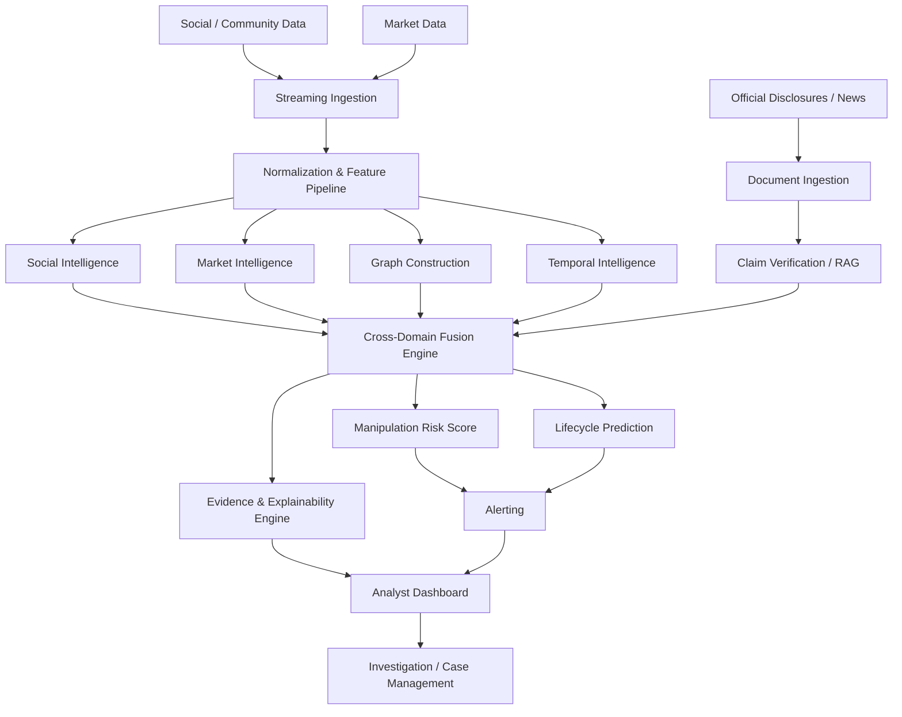
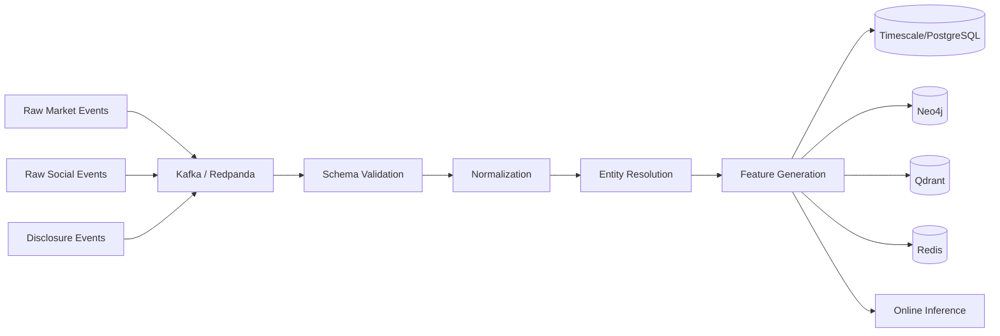
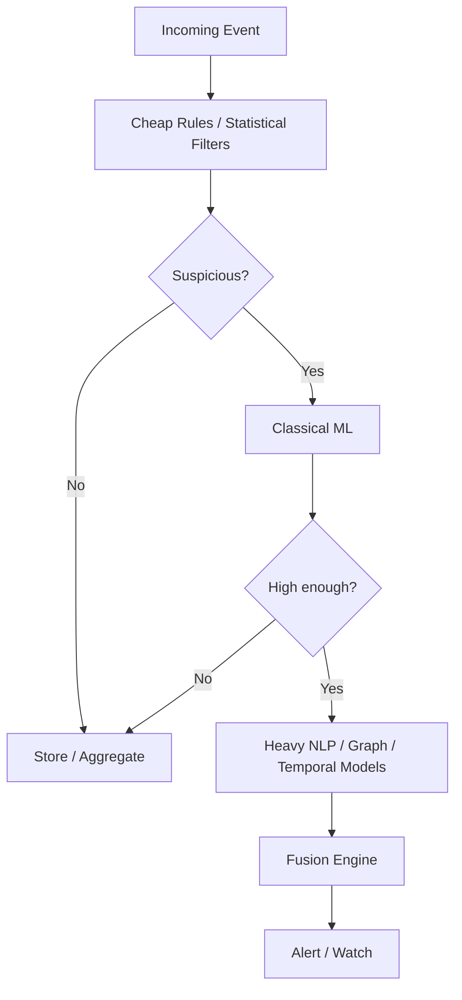
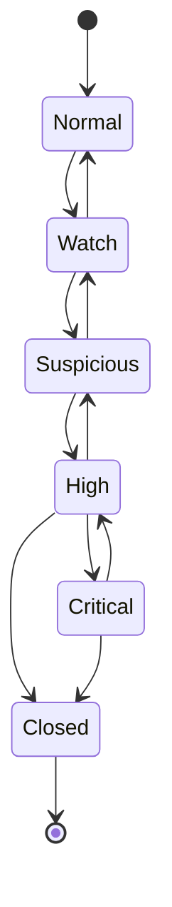
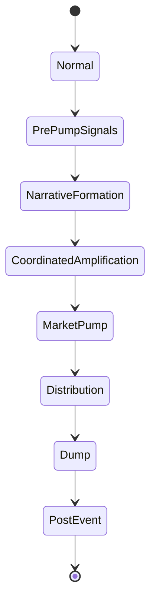
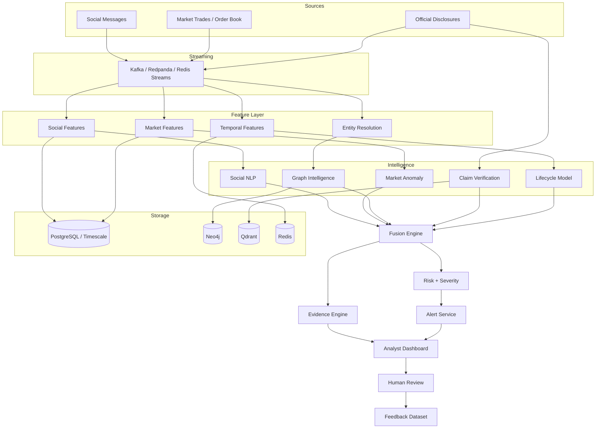

# Scam2Market
## Cross-Domain Pump-and-Dump Intelligence & Early-Warning Network

**Document type:** Complete Project Blueprint / Technical Design  
**Project status:** Proposed architecture for hackathon implementation  
**Primary domain:** Trading + Finance + AI/ML/DL + Graph Intelligence  
**Target build window:** 4 weeks  
**Version:** 1.0  
**Prepared:** August 2026

---

# 1. Executive Summary

**Scam2Market** is an AI-powered market-surveillance and early-warning platform designed to detect **coordinated pump-and-dump campaigns** by correlating signals from two worlds that are usually analyzed separately:

1. **Information / social manipulation**
   - coordinated posts
   - repeated narratives
   - bot-like amplification
   - abnormal mention velocity
   - misleading or unverifiable claims
   - connected account communities

2. **Market behavior**
   - abnormal returns
   - volume spikes
   - liquidity changes
   - volatility expansion
   - order-book imbalance
   - unusual trade intensity
   - price/volume divergence
   - abnormal behavior relative to the market and sector

The system does **not** attempt to decide guilt or make legal accusations. It produces a **manipulation-risk score, campaign-stage estimate, evidence graph, and analyst explanation** so an investor-protection team, broker, exchange, compliance team, or market-surveillance analyst can investigate faster.

The key idea is:

> **Detect the information campaign before or while it begins to influence market microstructure, rather than waiting until the price has already collapsed.**

The flagship capabilities are:

- **Early Campaign Detection**
- **Social Coordination Detection**
- **Narrative & Claim Intelligence**
- **Market Anomaly Detection**
- **Graph-Based Relationship Intelligence**
- **Temporal Lead/Lag Analysis**
- **Cross-Domain Fusion**
- **Manipulation Lifecycle Prediction**
- **Verified-Event Suppression**
- **Explainable Evidence Graphs**
- **Replay & Simulation Mode**
- **Real-Time Alerts**

---

# 2. Problem Statement

## 2.1 Formal Problem Statement

> **Develop a multimodal, graph-based, real-time market-surveillance system that detects coordinated pump-and-dump campaigns by correlating social-media manipulation, account coordination, narrative propagation, market anomalies, and temporal relationships, while producing an explainable manipulation-risk score and early-warning alerts.**

---

# 3. Why This Problem Matters

Pump-and-dump manipulation is difficult to detect because its evidence is distributed.

A market-only system may observe:

- sudden price increase
- volume spike
- volatility increase

But those can also occur because of:

- earnings announcements
- corporate actions
- macro news
- sector-wide movement
- legitimate investor interest

A social-only system may observe:

- positive sentiment
- rapidly increasing mentions
- viral posts

But those also occur legitimately.

The valuable signal appears when we connect the two.

Example:

```text
Social activity:
- 300 semantically similar promotional messages
- 70% posted by a tightly connected account cluster
- common claim: "major contract announcement coming"
- no matching official disclosure found

Market activity:
- volume = 14x normal
- abnormal return = +12%
- volatility = 6x baseline
- liquidity deteriorating

Timing:
- coordinated social spike starts 18 minutes before abnormal market activity

Result:
- high manipulation-risk alert
```

This is the central Scam2Market hypothesis:

> **Manipulation is not a single anomaly. It is a coordinated sequence of connected anomalies.**

---

# 4. Real-World Motivation

The project is grounded in real regulatory and research evidence.

In a 2026 SEBI enforcement order concerning stock recommendations distributed through social-media/Telegram channels, SEBI described a pattern in which recommendations were followed by favorable price/volume movement and alleged that beneficiaries used the resulting activity to offload shares. This is very close to the cross-domain pattern Scam2Market is designed to detect.

Recent research also supports the use of:

- social-message analysis for early pump detection,
- graph-based modeling,
- temporal learning,
- ensemble models,
- and multimodal market/social signals.

Scam2Market combines these ideas into a single industry-oriented architecture.

---

# 5. Product Vision

Scam2Market should behave like an **AI market-surveillance command center**.

Instead of only saying:

```text
XYZ price is abnormal.
```

the system should answer:

```text
Asset: XYZ

Manipulation Risk: 92.7 / 100
Severity: CRITICAL

Current Campaign Stage:
Stage 3 — Coordinated Amplification

Evidence:
- social mentions increased 31x in 27 minutes
- 248 accounts produced highly similar promotional content
- 67% of messages came from three connected communities
- social anomaly began 16 minutes before market anomaly
- trading volume reached 12.8x rolling baseline
- price movement was not explained by sector movement
- no matching official disclosure was found

Recommended analyst action:
- inspect evidence graph
- verify official disclosures
- review top coordinated account communities
- monitor for transition into distribution/dump stage
```

---

# 6. Target Users

Potential users include:

- Stock exchanges
- Broker surveillance teams
- Market regulators
- Financial intelligence units
- Investment platforms
- Investor-protection teams
- Compliance teams
- Risk-management teams
- Crypto exchanges
- Financial research teams
- Retail investors through a simplified warning interface

For the hackathon, the primary persona should be:

> **Market Surveillance Analyst**

This gives the application a focused enterprise workflow.

---

# 7. What Scam2Market Is Not

Scam2Market should **not** be presented as:

- a stock-price predictor
- a buy/sell recommendation bot
- an automated legal judgment system
- a tool that identifies a person as guilty
- an autonomous trading bot
- a social-media scraping system that ignores platform terms

The system should output:

> **risk indicators and evidence for investigation**

rather than:

> **definitive accusations**

---

# 8. Key Innovation

Most basic projects use:

```text
Social sentiment + stock price -> classification
```

Scam2Market uses:

```text
Social semantics
+ coordination behavior
+ account graph
+ narrative propagation
+ claim verification
+ market microstructure
+ market normalization
+ temporal lead/lag
+ graph intelligence
+ anomaly detection
+ lifecycle modeling
+ cross-domain fusion
+ explainability
-> manipulation-risk intelligence
```

The flagship novelty can be expressed as:

> **Model how coordinated narratives propagate from social networks into market microstructure and detect the campaign before the eventual collapse.**

---

# 9. High-Level System Architecture



---

# 10. Recommended Implementation Strategy

Build the project in layers.

## Layer 1 — Reliable Data & Statistical Baselines

Build first:

- market data ingestion
- social dataset ingestion
- rolling features
- price/volume anomaly rules
- mention-velocity rules
- basic dashboards

This creates a working system immediately.

## Layer 2 — Classical ML

Add:

- Isolation Forest
- LightGBM / XGBoost
- text classification
- account coordination features
- calibrated probability estimates

## Layer 3 — Graph Intelligence

Add:

- graph construction
- centrality
- community detection
- similarity
- GraphSAGE / GAT

## Layer 4 — Temporal Intelligence

Add:

- sequence models
- temporal graph features
- lead/lag
- lifecycle stage prediction

## Layer 5 — Cross-Domain Fusion

Fuse all model outputs.

## Layer 6 — Explainability & Investigation

Add:

- evidence graph
- SHAP
- RAG-based explanations
- case timelines
- replay mode

This progressive architecture ensures that a working demo exists even if the most advanced research modules need simplification.

---

# 11. Core Modules

Scam2Market should contain the following major modules:

1. **Data Ingestion Layer**
2. **Social Manipulation Intelligence**
3. **Narrative Intelligence**
4. **Account Coordination / Bot Intelligence**
5. **Market Surveillance Engine**
6. **Market-Normalization Engine**
7. **Graph Intelligence**
8. **Temporal Intelligence**
9. **Claim Verification / Event Legitimacy Engine**
10. **Cross-Domain Fusion Engine**
11. **Manipulation Lifecycle Engine**
12. **Explainability Engine**
13. **Alerting Engine**
14. **Analyst Investigation Dashboard**
15. **Replay Engine**
16. **Synthetic Campaign Generator**
17. **Model Monitoring & MLOps**
18. **Audit & Security Layer**

---

# 12. Module 1 — Data Ingestion

## 12.1 Market Data

Required market fields:

```text
timestamp
symbol
open
high
low
close
volume
trade_count
bid_price
ask_price
bid_quantity
ask_quantity
spread
order_book_depth
```

Not all data sources expose all fields. The system should use an adapter interface.

Example:

```python
class MarketDataProvider:
    def subscribe_trades(self, symbols): ...
    def subscribe_orderbook(self, symbols): ...
    def get_historical_candles(self, symbol, interval): ...
```

This allows the project to switch between:

- Binance / crypto market feeds
- licensed equity-market providers
- replay files
- simulated data

### Hackathon recommendation

Use **crypto exchange market data** for the live streaming demonstration because rich public WebSocket market streams are easier to obtain.

Use **replayed or licensed/publicly permitted equity data** for an Indian-market scenario.

---

## 12.2 Social Data

Possible inputs:

- public research datasets
- publicly accessible communities where access is authorized
- Reddit integrations subject to platform rules
- Telegram data obtained through permitted APIs/datasets
- financial discussion datasets
- synthetic coordinated campaigns
- manually created replay scenarios

Store:

```text
post_id
platform
author_id
timestamp
text
language
hashtags
urls
mentions
reply_to
repost_of
engagement
asset_mentions
```

---

## 12.3 Official Information

Use public official sources for claim verification:

- company exchange filings
- exchange announcements
- corporate disclosures
- regulatory announcements
- credible financial-news sources where terms permit
- issuer investor-relations releases

This becomes the **Event Legitimacy Engine**.

---

# 13. Data Pipeline



---

# 14. Streaming Topics

If Kafka/Redpanda is used:

```text
market.raw.trades
market.raw.orderbook
market.raw.candles

social.raw.posts
social.normalized.posts
social.asset_mentions

disclosures.raw
disclosures.normalized

features.market
features.social
features.graph
features.temporal

model.market_scores
model.social_scores
model.graph_scores
model.fusion_scores

alerts.detected
alerts.updated
```

For a smaller MVP, Redis Streams can replace Kafka.

---

# 15. Module 2 — Social Manipulation Intelligence

The objective is not simply sentiment analysis.

The system must measure:

- abnormal discussion growth
- promotional language
- urgency
- certainty
- unsupported claims
- repetitive narratives
- coordinated posting
- account synchronization

---

# 16. Social Feature Engineering

For each asset and time window:

```text
mention_count
unique_author_count
mention_velocity
mention_acceleration
positive_sentiment_ratio
negative_sentiment_ratio
hype_score
urgency_score
certainty_score
price_target_claim_count
announcement_claim_count
duplicate_text_ratio
semantic_similarity_mean
new_account_ratio
hashtag_concentration
url_concentration
repost_ratio
coordination_score
bot_probability_mean
```

Use multiple windows:

```text
1 minute
5 minutes
15 minutes
30 minutes
1 hour
6 hours
24 hours
```

This captures both fast and slow campaigns.

---

# 17. Mention Velocity

Define:

```text
mention_velocity =
mentions_in_current_window / expected_mentions
```

Example:

```text
Expected 15-min mentions = 12
Current 15-min mentions  = 264

Mention velocity = 22x baseline
```

The baseline should be asset-specific.

---

# 18. Mention Acceleration

Velocity shows how large the activity is.

Acceleration shows how quickly it is increasing.

```text
acceleration =
current_mention_velocity - previous_mention_velocity
```

A campaign often produces a steep acceleration curve.

---

# 19. Semantic Coordination Detection

Posts can be slightly rewritten while communicating the same campaign narrative.

Example:

```text
"XYZ target 100 tomorrow."
"XYZ is heading to 100."
"100 target for XYZ — huge breakout."
```

Exact duplicate matching is insufficient.

Generate embeddings:

```text
post_text -> embedding_model -> vector
```

Possible models:

- BGE-M3
- Sentence Transformers
- E5
- finance-domain embeddings
- FinBERT-derived representations

Find high-similarity clusters within a short time window.

Example condition:

```text
semantic_similarity > threshold
AND
time_difference < 15 minutes
AND
same_asset = true
```

This creates a **coordination cluster**.

---

# 20. Narrative Clustering

The system groups posts into narratives.

Example:

```text
Narrative N17:
"Company is about to announce a government contract"

Narrative N18:
"Big investor is secretly accumulating"

Narrative N19:
"Target price will double"
```

Pipeline:

```text
Posts
-> embeddings
-> clustering
-> cluster representative
-> LLM label/summary
```

Possible clustering methods:

- HDBSCAN
- DBSCAN
- K-Means
- BERTopic-style topic modeling

The LLM should label and summarize clusters, not decide manipulation by itself.

---

# 21. Promotional / Hype Classifier

Train a classifier with classes such as:

```text
NORMAL_DISCUSSION
NEWS_SHARING
ANALYSIS
PROMOTIONAL_HYPE
URGENCY_FOMO
UNVERIFIED_CLAIM
PUMP_ANNOUNCEMENT
```

Baseline:

- TF-IDF + Logistic Regression
- LightGBM

Advanced:

- BGE-M3 classifier
- FinBERT
- DeBERTa
- modern sentence encoder + small classification head

Use a lightweight model for streaming and a heavier model only for suspicious windows.

---

# 22. Asset & Ticker Extraction

This is harder than simple regex because tickers can be ambiguous.

Examples:

```text
ONE
LINK
NEAR
DOT
```

Pipeline:

```text
message
-> candidate ticker extraction
-> entity resolution
-> market universe validation
-> context matching
-> confidence score
```

Use:

- dictionary matching
- NER
- market symbol registry
- LLM fallback for ambiguous cases

Do not use an LLM on every message.

---

# 23. Module 3 — Bot & Coordination Intelligence

Scam campaigns may use automated or semi-automated accounts.

Potential features:

```text
account_age
posts_per_hour
burstiness
mean_inter_post_time
ticker_diversity
content_similarity
shared_url_ratio
shared_hashtag_ratio
repost_ratio
synchronization_score
activity_entropy
hour_of_day_pattern
community_overlap
```

No single feature proves bot behavior.

The output should be:

```text
automation/coordination likelihood
```

rather than an absolute claim that an account is a bot.

---

# 24. Synchronization Score

For accounts A and B:

```text
sync(A,B) =
frequency of semantically related posts
within a short temporal distance
```

Build a user-user edge when synchronization is repeatedly high.

This becomes an important graph feature.

---

# 25. Module 4 — Market Surveillance Engine

Market surveillance calculates how abnormal the asset is relative to its own historical behavior.

Core features:

```text
return_1m
return_5m
return_15m
return_1h

volume
relative_volume
volume_zscore

realized_volatility
volatility_zscore

spread
spread_change

trade_intensity
buy_sell_imbalance

orderbook_imbalance
liquidity_depth

momentum
drawdown
turnover
```

---

# 26. Statistical Baselines

Do not skip simple models.

They are fast and explainable.

Use:

- rolling mean
- rolling median
- rolling standard deviation
- robust Z-score
- EWMA
- MAD
- change-point detection

Example:

```text
relative_volume =
current_volume / rolling_median_volume
```

---

# 27. Dynamic Baselines

A static rule such as:

```text
volume > 1,000,000 -> suspicious
```

is bad.

For one asset 1M may be normal; for another it may be extreme.

Use:

```text
asset-specific
time-of-day-specific
day-of-week-aware
volatility-aware
liquidity-aware
```

baselines.

---

# 28. Unsupervised Market Anomaly Models

Good choices:

- Isolation Forest
- Local Outlier Factor
- One-Class SVM
- Autoencoder
- LSTM Autoencoder
- Transformer Autoencoder

Input vector:

```text
[
 return,
 volume_zscore,
 volatility,
 spread,
 imbalance,
 trade_intensity,
 liquidity,
 momentum
]
```

Output:

```text
market_anomaly_score
```

---

# 29. Supervised Market Models

If labeled pump events are available:

- LightGBM
- XGBoost
- Random Forest
- calibrated Logistic Regression

Why tree ensembles first?

They:

- work well on tabular features
- handle non-linear interactions
- train quickly
- provide feature importance
- are efficient in near-real-time systems

Use deep models only where sequences provide additional value.

---

# 30. Sequence Models

Advanced market-sequence model:

```text
last N market windows
-> temporal encoder
-> anomaly / pump probability
```

Candidates:

- LSTM
- GRU
- TCN
- Transformer
- Temporal Fusion Transformer

Recommended research path:

```text
LightGBM baseline
-> TCN/Transformer comparison
```

---

# 31. Module 5 — Market Normalization

One major source of false positives is legitimate market-wide movement.

Example:

```text
XYZ: +9%
Sector: +8.5%
Market: +7.8%
```

This is less suspicious than:

```text
XYZ: +19%
Sector: +0.6%
Market: +0.2%
```

Estimate expected return:

```text
expected_return =
market_factor
+ sector_factor
+ historical_beta_adjustment
```

Then:

```text
abnormal_return =
actual_return - expected_return
```

Use the abnormal return rather than raw price change wherever possible.

---

# 32. Legitimate Volatility Adjustment

If the entire market is highly volatile, thresholds should widen.

Use:

```text
asset anomaly
conditioned on
market regime
```

Possible market regimes:

```text
LOW_VOL
NORMAL
HIGH_VOL
CRISIS
TRENDING
SIDEWAYS
```

Regime detection:

- K-Means
- HMM
- change-point detection
- volatility quantiles

---

# 33. Module 6 — Graph Intelligence

Graph modeling is one of Scam2Market's biggest differentiators.

## Node Types

```text
User
Post
Asset
Narrative
Hashtag
URL
Platform
NewsArticle
Disclosure
Campaign
Alert
```

Optional simulated or institution-only nodes:

```text
TradingAccount
Device
IP
Wallet
Order
Trade
```

Do not claim access to private broker data unless the project actually has it.

---

# 34. Graph Relationships

```text
USER -> POSTED -> POST
USER -> REPOSTED -> POST
USER -> FOLLOWS -> USER

POST -> MENTIONS -> ASSET
POST -> USES -> HASHTAG
POST -> LINKS_TO -> URL
POST -> EXPRESSES -> NARRATIVE

NARRATIVE -> TARGETS -> ASSET

DISCLOSURE -> ABOUT -> ASSET
NEWS_ARTICLE -> ABOUT -> ASSET

ALERT -> CONCERNS -> ASSET
ALERT -> INVOLVES -> CAMPAIGN
```

Optional institutional edges:

```text
ACCOUNT -> TRADED -> ASSET
ACCOUNT -> USES_DEVICE -> DEVICE
ACCOUNT -> CONNECTED_TO -> ACCOUNT
```

---

# 35. Graph Database

Recommended:

**Neo4j**

Use it for:

- graph exploration
- analyst investigation
- centrality
- community detection
- path exploration
- graph features
- evidence visualization

Use Neo4j Graph Data Science where appropriate.

---

# 36. Graph Features

For user nodes:

```text
degree
weighted_degree
pagerank
betweenness
community_id
clustering_coefficient
synchronization_degree
narrative_overlap
shared_url_count
shared_asset_count
```

For campaign graphs:

```text
graph_density
number_of_communities
largest_community_ratio
propagation_depth
propagation_speed
centralization
account_reuse_ratio
```

---

# 37. Community Detection

Start with:

- Louvain
- Leiden

Objective:

> Find clusters of accounts that repeatedly amplify the same asset or narrative.

Example:

```text
Campaign:
248 accounts

Community 1 = 81 accounts
Community 2 = 63 accounts
Community 3 = 29 accounts

Top 3 communities generated 71% of suspicious posts.
```

---

# 38. Graph Neural Networks

Phase 1:

```text
NetworkX / Neo4j algorithms
```

Phase 2:

```text
GraphSAGE
GAT
```

Phase 3:

```text
Heterogeneous GNN
Temporal GNN
```

Potential libraries:

- PyTorch Geometric
- DGL
- Neo4j GDS

---

# 39. Why Temporal GNNs Matter

A campaign evolves.

```text
09:40 -> 7 suspicious accounts
09:50 -> 24
10:00 -> 103
10:10 -> 391
```

A static graph loses this behavior.

A temporal model captures:

- propagation
- recruitment
- repeated coordinated activity
- changing asset relationships

A strong advanced model can combine:

```text
graph attention
+
temporal transformer
```

---

# 40. Module 7 — Temporal Intelligence

Pump-and-dump activity is sequential.

Potential lifecycle:

```text
Stage 0 — Normal
Stage 1 — Pre-Pump / Accumulation Signals
Stage 2 — Narrative Formation
Stage 3 — Coordinated Amplification
Stage 4 — Market Pump / Retail Participation
Stage 5 — Distribution / Exit
Stage 6 — Dump / Collapse
Stage 7 — Post-Event
```

Important:

**Stage 1 should not imply illegal accumulation unless actual trading evidence supports it.**

For public-data mode, label it:

```text
PRE-PUMP SIGNALS
```

instead of claiming hidden insider accumulation.

---

# 41. Lifecycle Prediction

Inputs:

```text
social_growth
coordination_growth
market_anomaly
volume_acceleration
price_acceleration
liquidity
graph_growth
claim_verification
```

Models:

- Hidden Markov Model baseline
- LightGBM multiclass
- LSTM
- Transformer

Output:

```text
current_stage
next_stage_probability
confidence
```

Example:

```text
Current:
Stage 3 — Coordinated Amplification

Probability of Stage 4 within next 30 min:
0.74
```

This probability must be treated as an experimental model output, not certainty.

---

# 42. Social-to-Market Lead/Lag Intelligence

One of the strongest project features.

Track change points:

```text
social_change_point
volume_change_point
price_change_point
volatility_change_point
```

Then calculate:

```text
social_to_volume_lag =
volume_change_point - social_change_point

social_to_price_lag =
price_change_point - social_change_point
```

Example:

```text
Social anomaly: 10:02
Volume anomaly: 10:17
Price anomaly: 10:24

Lead:
Social -> Volume = 15 min
Social -> Price  = 22 min
```

This provides a measurable **early-warning lead time**.

---

# 43. Causal-Evidence Layer

Correlation is not proof of causality.

The project should explicitly state this.

Possible exploratory methods:

- cross-correlation
- lag analysis
- Granger-style temporal tests
- change-point analysis
- event studies
- difference-in-differences
- causal forests
- structural causal models

Output language:

```text
"consistent with a social signal preceding the market move"
```

not:

```text
"the posts caused the market move"
```

unless the evidence truly justifies it.

---

# 44. Module 8 — Event Legitimacy & Claim Verification

This module is critical for reducing false positives.

Suppose:

```text
Social mentions ↑
Volume ↑
Price ↑
```

The cause may be legitimate earnings news.

The system checks:

```text
official disclosure?
exchange announcement?
earnings event?
corporate action?
macro event?
sector-wide event?
credible reporting?
```

---

# 45. Claim Extraction

From posts:

```text
"XYZ won a ₹500 crore government contract"
```

Extract:

```json
{
  "subject": "XYZ",
  "claim_type": "CONTRACT_AWARD",
  "amount": "₹500 crore",
  "counterparty": "government",
  "claim_text": "...",
  "timestamp": "..."
}
```

---

# 46. RAG-Based Verification

Pipeline:

```text
Claim
-> retrieval query
-> Qdrant
-> relevant disclosures/news
-> evidence ranking
-> LLM structured verification
```

Possible result:

```json
{
  "status": "NOT_VERIFIED",
  "supporting_sources": [],
  "contradicting_sources": [],
  "confidence": 0.81
}
```

Allowed statuses:

```text
VERIFIED
PARTIALLY_VERIFIED
NOT_VERIFIED
CONTRADICTED
INSUFFICIENT_INFORMATION
```

Avoid calling a claim "false" merely because no source was found.

---

# 47. Vector Database

Recommended:

**Qdrant**

Collections:

```text
social_posts_embeddings
narrative_embeddings
official_disclosures
financial_news
campaign_summaries
```

Metadata example:

```json
{
  "asset": "XYZ",
  "source_type": "exchange_disclosure",
  "published_at": "...",
  "document_id": "...",
  "jurisdiction": "IN"
}
```

---

# 48. Module 9 — Cross-Domain Fusion Engine

The fusion model combines specialized detectors.

Example inputs:

```text
social_anomaly_score
hype_score
coordination_score
bot_likelihood
narrative_risk_score
market_anomaly_score
abnormal_return_score
volume_anomaly_score
graph_anomaly_score
temporal_score
claim_verification_risk
event_legitimacy_score
```

---

# 49. Fusion Strategy

## Version A — Interpretable Baseline

Use a transparent weighted score.

Weights must be tuned using validation data.

Example only:

```text
risk =
w1 * market_anomaly
+ w2 * social_anomaly
+ w3 * coordination
+ w4 * graph_score
+ w5 * temporal_score
+ w6 * claim_risk
- w7 * legitimate_event_score
```

Do not hardcode arbitrary weights as the final system.

---

## Version B — Supervised Fusion

Train:

- Logistic Regression
- LightGBM
- XGBoost

Input:

```text
all detector outputs + selected raw features
```

Output:

```text
P(manipulation_event)
```

Recommended production-style starting point:

> **LightGBM + probability calibration**

because it is fast, explainable, and strong on tabular fusion features.

---

## Version C — Multimodal Deep Fusion

Advanced research version:

```text
Social text embedding ------\
Market sequence embedding ---\
Graph embedding --------------> Cross-Attention Fusion -> Risk
Temporal embedding ----------/
Claim embedding -------------/
```

Possible architecture:

- modality-specific encoders
- cross-attention
- gating layer
- calibrated prediction head

Only implement this if enough training data exists.

---

# 50. Probability Calibration

A model that outputs `0.92` should ideally mean events with similar scores are actually positive roughly 92% of the time.

Use:

- Platt scaling
- isotonic regression
- temperature scaling

Measure:

- Brier score
- Expected Calibration Error

This gives the project a mature risk-system design.

---

# 51. Alert Severity

Example severity mapping:

```text
0–29   LOW
30–49  WATCH
50–69  SUSPICIOUS
70–84  HIGH
85–100 CRITICAL
```

Thresholds should be validated, not assumed.

Use hysteresis to prevent alert flapping.

Example:

```text
enter HIGH at >= 75
leave HIGH only after < 65
```

---

# 52. Module 10 — Explainability

A surveillance system must explain itself.

Output:

```text
Top contributing signals:
1. social mention acceleration
2. coordination cluster density
3. abnormal volume
4. social-to-market lead
5. unsupported viral narrative
```

Use:

- SHAP
- feature importance
- graph paths
- cluster evidence
- nearest historical incidents
- timeline visualization

---

# 53. LLM Role

The LLM should be the **explanation and investigation layer**, not the primary detector.

Good uses:

- narrative summarization
- claim extraction
- claim comparison
- analyst report generation
- natural-language querying
- evidence summarization
- investigation assistant

Bad use:

```text
"Here are 500 posts. LLM, decide whether market manipulation happened."
```

The detection must remain grounded in numerical and graph evidence.

---

# 54. Evidence-Bounded LLM

The LLM should receive structured evidence:

```json
{
  "asset": "XYZ",
  "risk": 92.7,
  "market_anomaly": 0.89,
  "coordination": 0.94,
  "social_to_market_lead_minutes": 17,
  "top_narrative": "...",
  "claim_status": "NOT_VERIFIED",
  "evidence_ids": ["..."]
}
```

System instruction:

> Use only supplied evidence. Distinguish observations, model inferences, and unknowns. Never make accusations or invent sources.

---

# 55. Example Analyst Explanation

```text
XYZ was flagged as HIGH RISK.

Observed:
- mentions rose approximately 28x over the asset-specific baseline
- 347 accounts generated semantically similar promotional messages
- 63% of suspicious posts belonged to three highly connected communities
- trading volume rose 14x relative to the rolling median
- market-normalized return became strongly abnormal

Temporal evidence:
- the coordinated social spike began 17 minutes before the detected market anomaly

Information validation:
- the dominant narrative concerned an alleged acquisition
- no matching official disclosure was found in the indexed source set

Interpretation:
These combined observations are consistent with a coordinated promotional campaign and warrant analyst review. They do not independently establish legal wrongdoing.
```

---

# 56. Module 11 — Investigation Dashboard

Core pages:

## Page 1 — Command Center

Shows:

- market-wide watchlist
- highest-risk assets
- active campaigns
- risk heat map
- latest alerts
- live market/social activity

---

## Page 2 — Asset Intelligence

Shows:

- price chart
- volume
- abnormal return
- social mentions
- sentiment/hype
- risk score
- lifecycle stage
- narrative clusters
- recent alerts

Overlay social events on price chart.

---

## Page 3 — Campaign Investigation

Shows:

- timeline
- involved accounts
- communities
- top narratives
- coordination clusters
- evidence
- claim status
- linked assets
- risk evolution

---

## Page 4 — Evidence Graph

Interactive graph:

```text
User -> Post -> Narrative -> Asset
             -> URL
             -> Hashtag
```

Features:

- click node
- filter edge type
- filter time range
- show central accounts
- show communities
- show evidence paths

---

## Page 5 — Narrative Intelligence

Shows:

- dominant narratives
- narrative growth
- credibility/verification state
- first seen
- top amplifiers
- semantic clusters

---

## Page 6 — Market Microstructure

Shows:

- order-book imbalance
- spread
- trade intensity
- volatility
- liquidity
- relative volume
- anomaly scores

---

## Page 7 — Model Explainability

Shows:

- fusion score breakdown
- SHAP values
- detector confidence
- model version
- uncertainty
- historical similarity

---

## Page 8 — Replay Mode

Replay an incident minute-by-minute.

Controls:

```text
PLAY
PAUSE
1x / 2x / 5x / 10x
Jump to first anomaly
Jump to first alert
Jump to dump
```

The graph, market chart, narrative clusters, and risk gauge update as time advances.

This is one of the strongest hackathon demo features.

---

# 57. Replay Engine

Replay records should use event-time.

Example:

```json
{
  "timestamp": "2026-01-20T10:04:21Z",
  "event_type": "SOCIAL_POST",
  "payload": {}
}
```

The replay engine publishes these events into the same pipeline used for live data.

This is important:

> **Live mode and replay mode should share the same inference architecture.**

It proves the system is real rather than a pre-rendered animation.

---

# 58. Synthetic Campaign Generator

Real labeled pump datasets are limited and highly imbalanced.

Build a simulator capable of generating:

1. normal asset behavior
2. legitimate news rally
3. organic viral discussion
4. coordinated social pump
5. bot-assisted campaign
6. fake-rumor campaign
7. low-liquidity pump
8. high-market-volatility false-positive scenario
9. gradual campaign
10. failed campaign

---

# 59. Synthetic Social Generation

Generate account populations:

```text
organic_accounts
coordinated_accounts
high_frequency_accounts
influencers
bots/synthetic amplifiers
```

Generate realistic differences in:

- posting time
- text paraphrases
- hashtags
- URLs
- sentiment
- engagement

Do not make every malicious message identical.

---

# 60. Synthetic Market Generation

Possible approach:

```text
base stochastic price process
+ volatility regime
+ normal volume pattern
+ injected pump impact
+ liquidity changes
+ dump process
```

Use simulation only for development and stress testing.

Clearly separate:

```text
REAL DATA RESULTS
vs
SYNTHETIC DATA RESULTS
```

in all reports.

---

# 61. Data Labeling

Possible labels:

```text
NORMAL
LEGITIMATE_NEWS_EVENT
ORGANIC_SOCIAL_SURGE
PUMP_PRECURSOR
PUMP_ACTIVE
DISTRIBUTION
DUMP
UNKNOWN
```

For event-level detection:

```text
PUMP_CAMPAIGN
NON_PUMP
```

For posts:

```text
NORMAL
PROMOTIONAL
PUMP_ANNOUNCEMENT
UNVERIFIED_CLAIM
```

---

# 62. Class Imbalance

Pump events are rare.

Never optimize only for accuracy.

Use:

- class weights
- focal loss
- careful under-sampling
- SMOTE for appropriate tabular experiments
- event-based sampling
- hard-negative mining

Avoid generating synthetic samples across time in a way that leaks future information.

---

# 63. Train/Validation/Test Splitting

Do **time-based splits**.

Bad:

```text
random train/test split
```

because future observations from the same campaign can leak into training.

Better:

```text
Train:
Jan–Jun

Validation:
Jul

Test:
Aug–Sep
```

Even better:

- hold out complete campaigns
- hold out entire assets
- test cross-market generalization

---

# 64. Evaluation Metrics

## Classification

Use:

```text
Precision
Recall
F1
PR-AUC
ROC-AUC
```

PR-AUC is particularly useful for imbalanced detection.

---

## Alert Metrics

Measure:

```text
false alerts per asset/day
alert precision
alert recall
alert stability
```

---

## Early Detection Metrics

Important:

```text
time_to_detection
lead_time_before_price_spike
lead_time_before_peak
lead_time_before_dump
percentage_detected_before_market_spike
```

Example:

```text
Campaign started:      10:00
Price pump accelerated:10:31
Scam2Market alert:     10:14

Early-warning lead:
17 minutes
```

---

## Ranking Metrics

If the system ranks assets:

```text
Precision@K
Recall@K
NDCG@K
```

Example:

> Did the manipulated asset appear in the top 5 surveillance candidates?

---

# 65. False-Positive Testing

Create difficult negative examples.

### Case A — Earnings rally

```text
social ↑
volume ↑
price ↑
official earnings disclosure = yes
```

Expected:

```text
market anomaly high
manipulation risk reduced
```

### Case B — Sector rally

```text
asset +9%
sector +8%
```

Expected:

```text
abnormal-return risk low
```

### Case C — Organic viral post

```text
social ↑
but account diversity high
coordination low
market effect weak
```

Expected:

```text
watch only
```

### Case D — Coordinated hype but no market impact

Expected:

```text
social manipulation risk high
full pump-and-dump risk moderate
```

This distinction is important.

---

# 66. Database Architecture

Recommended:

```text
PostgreSQL / TimescaleDB
- structured operational data
- time series
- alerts
- campaigns
- model outputs

Neo4j
- account/post/narrative relationships

Qdrant
- semantic embeddings
- disclosure retrieval

Redis
- feature cache
- online state
- rate limiting
- sliding windows
```

A smaller deployment can run with:

```text
PostgreSQL + pgvector
Neo4j
Redis
```

and add Qdrant only when needed.

---

# 67. Relational Schema

## assets

```text
id
symbol
name
asset_type
exchange
sector
status
created_at
```

## market_events

```text
id
asset_id
timestamp
event_type
price
quantity
bid
ask
metadata_json
```

## candles

```text
asset_id
timestamp
interval
open
high
low
close
volume
trade_count
```

## social_posts

```text
id
platform
external_id
author_id
timestamp
text
language
engagement
raw_json
```

## post_asset_mentions

```text
post_id
asset_id
confidence
```

## narratives

```text
id
label
summary
first_seen
last_seen
embedding_id
```

## post_narratives

```text
post_id
narrative_id
confidence
```

## alerts

```text
id
asset_id
campaign_id
timestamp
risk_score
severity
status
model_version
explanation_json
```

## campaigns

```text
id
asset_id
start_time
end_time
current_stage
max_risk
status
```

## model_scores

```text
id
asset_id
timestamp
model_name
model_version
score
features_json
```

## claims

```text
id
narrative_id
asset_id
claim_text
claim_type
verification_status
verification_confidence
```

## evidence

```text
id
alert_id
evidence_type
source_ref
score
metadata_json
```

---

# 68. Feature Store

For each asset/time bucket:

```text
asset_id
window_end
window_size

price_return
abnormal_return
relative_volume
volume_zscore
volatility_zscore
spread_change
orderbook_imbalance

mention_count
mention_velocity
mention_acceleration
hype_ratio
semantic_coordination
bot_ratio

community_density
largest_community_ratio
propagation_speed

social_to_market_lag
claim_risk
event_legitimacy
```

Use the same feature definitions in training and online inference.

---

# 69. API Design

Backend:

**FastAPI**

---

## Watchlist

```http
GET /api/v1/assets/watchlist
```

Returns:

```json
[
  {
    "symbol": "XYZ",
    "risk_score": 92.7,
    "severity": "CRITICAL",
    "stage": "COORDINATED_AMPLIFICATION"
  }
]
```

---

## Asset Intelligence

```http
GET /api/v1/assets/{symbol}/intelligence
```

---

## Market Timeline

```http
GET /api/v1/assets/{symbol}/timeline
```

---

## Narratives

```http
GET /api/v1/assets/{symbol}/narratives
```

---

## Graph

```http
GET /api/v1/campaigns/{campaign_id}/graph
```

---

## Alert Detail

```http
GET /api/v1/alerts/{alert_id}
```

---

## Evidence

```http
GET /api/v1/alerts/{alert_id}/evidence
```

---

## Explain Alert

```http
POST /api/v1/alerts/{alert_id}/explain
```

The LLM must explain existing evidence, not recalculate the risk.

---

## Replay

```http
POST /api/v1/replay/start
POST /api/v1/replay/pause
POST /api/v1/replay/resume
POST /api/v1/replay/seek
```

---

# 70. Real-Time Frontend Updates

Use:

- WebSocket
- Server-Sent Events

Events:

```text
risk.updated
alert.created
campaign.stage_changed
narrative.detected
graph.updated
market.anomaly
```

---

# 71. Recommended Technology Stack

## Frontend

```text
Next.js / React
TypeScript
Tailwind CSS
ECharts / Recharts / Plotly
Cytoscape.js / Sigma.js for graphs
```

---

## Backend

```text
Python
FastAPI
Pydantic
SQLAlchemy
Celery / Dramatiq optional
```

---

## Streaming

Choose one:

```text
Redpanda / Kafka
```

or simpler MVP:

```text
Redis Streams
```

---

## Storage

```text
PostgreSQL
TimescaleDB extension
Neo4j
Qdrant
Redis
```

---

## ML

```text
scikit-learn
LightGBM
XGBoost
PyTorch
PyTorch Geometric
Transformers
sentence-transformers
```

---

## NLP

```text
BGE-M3
FinBERT
DeBERTa / other encoder if needed
HDBSCAN
```

---

## MLOps

```text
MLflow
DVC optional
Prometheus
Grafana
OpenTelemetry
```

---

## Deployment

```text
Docker
Docker Compose
GitHub Actions
Cloud VM / container platform
```

---

# 72. Efficient Inference Architecture

Do not execute every expensive model for every message.

Use **cascade inference**.



This significantly improves runtime efficiency.

---

# 73. Online vs Offline Features

## Online

Must update quickly:

```text
price
volume
spread
mention counts
velocity
basic coordination
risk score
```

## Offline / asynchronous

Can update more slowly:

```text
large graph embeddings
historical communities
heavy LLM summaries
deep claim verification
long-term account features
```

---

# 74. Caching

Use Redis for:

```text
rolling feature windows
asset baselines
recent embeddings
current risk state
model metadata
rate limits
```

---

# 75. Batch Embeddings

Instead of embedding each message individually:

```text
collect 16–64 messages
-> batch inference
-> store vectors
```

For urgent suspicious events, allow a low-latency path.

---

# 76. Model Architecture Recommendation

Do not build one giant neural network first.

Recommended production-style ensemble:

```text
Social Model
    LightGBM + text embedding features

Market Model
    LightGBM / XGBoost

Sequence Model
    TCN or Transformer

Graph Model
    GraphSAGE / GAT

Claim Verification
    retrieval + LLM

Fusion Model
    calibrated LightGBM
```

Advanced research extension:

```text
spatio-temporal heterogeneous GNN
+
cross-modal attention
```

---

# 77. Suggested Model Progression

## Milestone 1

```text
rolling statistics
+ threshold rules
```

## Milestone 2

```text
Isolation Forest
+ LightGBM
```

## Milestone 3

```text
text embeddings
+ narrative clustering
```

## Milestone 4

```text
graph features
+ community detection
```

## Milestone 5

```text
GraphSAGE / GAT
```

## Milestone 6

```text
temporal sequence model
```

## Milestone 7

```text
fusion model
```

## Milestone 8

```text
temporal GNN / multimodal fusion
```

Stop at the milestone that gives the best validated result.

---

# 78. Research Dataset Strategy

Use a combination of:

## A. Public pump-and-dump research datasets

Especially datasets derived from Telegram pump campaigns.

A 2026 paper, **PumpSense**, reports a dataset with:

- more than 280,000 Telegram posts
- 39 pump-organizing groups
- 2,246 manually identified pump announcements

This is highly relevant for the social-message detection component.

Verify the associated paper/repository licensing before use.

---

## B. Historical Market Data

For crypto:

- exchange historical candles
- trades
- order-book snapshots if available

For a live demo:

- Binance public market WebSocket feeds can provide trades, ticker, candlesticks, book ticker, and depth streams according to current official documentation.

---

## C. Stock / Forum Research Data

The paper **Detecting Pump&Dump Stock Market Manipulation from Online Forums** demonstrates a research direction connecting online forum language with stock pump-and-dump timing.

Use the paper to guide feature design even if its raw dataset is not directly reusable.

---

## D. Synthetic Dataset

Generate controlled examples for:

- edge cases
- false positives
- replay
- stress testing

---

# 79. Data Ethics

Only use:

- public data
- properly licensed datasets
- platform APIs according to terms
- data the team is authorized to process

Avoid:

- unauthorized private-group collection
- evasion of API restrictions
- deanonymization
- collecting sensitive personal information unnecessarily

For demos, use pseudonymous identifiers:

```text
user_001
user_002
```

---

# 80. Research Findings That Inform the Architecture

## PumpSense — 2026

Research reports that message-level Telegram analysis can detect pump announcements rapidly and that modern embedding/transformer approaches can outperform some lightweight baselines. It also highlights the difficulty of extracting target tickers accurately.

**Project implication:**

- build message-level social detection
- perform ticker entity resolution carefully
- keep low-latency NLP

---

## Spatio-Temporal GNN Research — 2026

Recent research on cryptocurrency market fraud reports improvements from combining learned market connectivity with temporal Transformer encoding.

**Project implication:**

- do not treat each asset independently
- graph-based market relationships are a valuable advanced extension

---

## Online Forum Stock Pump Detection — 2023

Research shows online discussion language can provide useful predictive signals for stock pump-and-dump detection.

**Project implication:**

- social semantics should be a core model, not a decorative sentiment feature

---

# 81. Explainability Requirements

Every HIGH/CRITICAL alert should contain:

```text
risk score
confidence / uncertainty
top features
timeline
market evidence
social evidence
graph evidence
narrative evidence
verification evidence
model version
data freshness
```

---

# 82. Uncertainty

The system should output uncertainty.

Example:

```text
Risk: 81
Confidence: MEDIUM

Reason:
market and social signals are strong,
but graph coverage is incomplete.
```

This is better than pretending every probability is precise.

Possible methods:

- calibrated models
- ensembles
- conformal prediction
- prediction intervals

---

# 83. Data Quality Score

Add a data-quality score:

```text
market_coverage
social_coverage
graph_coverage
disclosure_coverage
data_delay
```

Example:

```text
Detection confidence reduced because social data coverage is partial.
```

This is an industry-quality feature.

---

# 84. Alert State Machine



Transitions are controlled using validated thresholds and hysteresis.

---

# 85. Campaign State Machine



In public-data mode, do not label hidden accumulation unless evidence exists.

---

# 86. Case Management

Each alert becomes an investigation case.

Fields:

```text
case_id
asset
opened_at
severity
analyst
status
notes
evidence_refs
model_version
resolution
```

Statuses:

```text
OPEN
UNDER_REVIEW
BENIGN_EVENT
SUSPICIOUS
ESCALATED
CLOSED
```

Analyst feedback can later become supervised training labels.

---

# 87. Human-in-the-Loop Learning

When analysts close cases:

```text
model alert
-> analyst decision
-> feedback store
-> training dataset
-> next model version
```

This makes the system improve over time.

Do not automatically retrain directly from every analyst label without validation.

---

# 88. MLOps

Track:

- model version
- dataset version
- feature schema
- hyperparameters
- metrics
- training date
- calibration
- deployment time

Use MLflow.

Example model names:

```text
social_classifier_v1
market_anomaly_v3
graph_risk_v2
fusion_v4
```

---

# 89. Drift Monitoring

Watch for:

```text
feature drift
prediction drift
concept drift
language drift
new promotion phrases
new assets
new platform behavior
```

Metrics:

- PSI
- KS test
- embedding drift
- alert-rate changes
- calibration drift

---

# 90. Backend Service Architecture

Possible services:

```text
ingestion-service
market-feature-service
social-nlp-service
graph-service
claim-verification-service
fusion-service
alert-service
replay-service
case-service
api-gateway
```

For a one-month project, keep these as logical modules in a modular monolith or a few services.

Do **not** create many microservices just to look enterprise-grade.

---

# 91. Recommended MVP Deployment

```text
frontend
backend
worker
postgres-timescale
redis
neo4j
qdrant
redpanda
mlflow
```

All through Docker Compose.

Optional:

```text
prometheus
grafana
```

---

# 92. Repository Structure

```text
scam2market/
│
├── README.md
├── docker-compose.yml
├── .env.example
│
├── docs/
│   ├── architecture.md
│   ├── data_dictionary.md
│   ├── model_cards/
│   ├── api.md
│   └── evaluation.md
│
├── backend/
│   ├── app/
│   │   ├── api/
│   │   ├── core/
│   │   ├── db/
│   │   ├── models/
│   │   ├── schemas/
│   │   ├── services/
│   │   └── main.py
│   └── tests/
│
├── frontend/
│   ├── app/
│   ├── components/
│   ├── lib/
│   └── public/
│
├── ingestion/
│   ├── market/
│   ├── social/
│   ├── disclosures/
│   └── replay/
│
├── ml/
│   ├── common/
│   ├── social/
│   ├── market/
│   ├── graph/
│   ├── temporal/
│   ├── fusion/
│   └── lifecycle/
│
├── data/
│   ├── raw/
│   ├── interim/
│   ├── processed/
│   ├── synthetic/
│   └── replay/
│
├── graph/
│   ├── schema/
│   ├── loaders/
│   └── algorithms/
│
├── rag/
│   ├── ingestion/
│   ├── retrieval/
│   └── verification/
│
├── simulation/
│   ├── social_generator/
│   ├── market_generator/
│   └── scenarios/
│
├── monitoring/
│   ├── prometheus/
│   └── grafana/
│
├── scripts/
│
└── tests/
    ├── unit/
    ├── integration/
    ├── replay/
    └── model/
```

---

# 93. Configuration

Use configuration files rather than code constants.

Example:

```yaml
features:
  windows:
    - 1m
    - 5m
    - 15m
    - 1h

alerts:
  watch_threshold: 35
  suspicious_threshold: 55
  high_threshold: 75
  critical_threshold: 90

models:
  social: social_classifier_v1
  market: market_lgbm_v2
  graph: graph_gat_v1
  fusion: fusion_lgbm_v1
```

Threshold values above are placeholders until validated.

---

# 94. Testing Strategy

## Unit Tests

Test:

- feature calculations
- ticker extraction
- schema validation
- threshold logic
- score calibration
- graph builders

---

## Integration Tests

Test:

```text
event ingestion
-> feature generation
-> inference
-> fusion
-> alert
-> frontend API
```

---

## Replay Tests

Replay known scenarios and assert:

```text
alert generated?
correct asset?
lead time?
severity stability?
```

---

## Model Tests

Validate:

- no data leakage
- temporal split
- class balance
- calibration
- drift
- feature availability

---

## Failure Tests

Simulate:

- missing social feed
- market API outage
- delayed messages
- duplicate events
- out-of-order events
- Neo4j unavailable
- LLM unavailable

The core detector should continue even if the LLM is unavailable.

---

# 95. Resilience

Use:

- retries
- backoff
- dead-letter queue
- idempotency
- event deduplication
- graceful degradation

Example:

```text
Qdrant unavailable
-> claim verification degraded
-> core risk detection continues
-> alert shows "verification unavailable"
```

---

# 96. Security

Minimum controls:

- secrets in environment/secret manager
- authentication
- RBAC
- audit logs
- input validation
- API rate limiting
- encrypted transport
- pseudonymization
- dependency scanning

Roles:

```text
ANALYST
SENIOR_ANALYST
ADMIN
VIEWER
```

---

# 97. Auditability

Every alert should record:

```text
input data references
feature snapshot
model versions
threshold version
timestamp
explanation
analyst actions
```

This makes results reproducible.

---

# 98. Responsible AI

Because a false accusation can be harmful:

1. label outputs as **risk indicators**
2. include uncertainty
3. show supporting evidence
4. allow human review
5. avoid identifying real individuals unnecessarily
6. separate public facts from model inference
7. never invent evidence
8. preserve model/data provenance
9. maintain appeal/review capability in enterprise use
10. document limitations

---

# 99. Performance Targets

These are **engineering targets**, not guaranteed results.

Suggested hackathon targets:

```text
Market event ingestion latency:
< 1 second locally where feed permits

Rolling feature update:
< 500 ms per tracked asset

Lightweight social classification:
< 1 second per batch

Fusion inference:
< 100 ms once features are available

Dashboard update:
1–2 seconds

Replay:
up to 10x–50x real time
```

Model-quality targets should be defined relative to baselines.

Example:

```text
Improve PR-AUC over market-only baseline
Reduce false positives using legitimacy engine
Increase early-warning lead using social signals
```

These comparisons are more credible than arbitrary "95% accuracy" goals.

---

# 100. Primary Experimental Questions

The project should answer research questions.

## RQ1

Does adding social information improve detection versus market-only models?

Compare:

```text
Market only
vs
Market + Social
```

---

## RQ2

Do graph features improve detection?

Compare:

```text
Market + Social
vs
Market + Social + Graph
```

---

## RQ3

Does official-event verification reduce false positives?

Compare false-positive rate before and after legitimacy adjustment.

---

## RQ4

Can social activity provide meaningful early-warning lead time?

Measure social-to-market lead.

---

## RQ5

Does a temporal GNN outperform tabular/sequence baselines?

Only attempt if time and data allow.

---

# 101. Ablation Study

A strong hackathon presentation can show:

| Model | Market | Social | Graph | Verification | PR-AUC | Lead Time |
|---|---:|---:|---:|---:|---:|---:|
| Baseline | ✓ | | | | TBD | TBD |
| M2 | ✓ | ✓ | | | TBD | TBD |
| M3 | ✓ | ✓ | ✓ | | TBD | TBD |
| Final | ✓ | ✓ | ✓ | ✓ | TBD | TBD |

Populate only with actual measured values.

---

# 102. Demo Scenario

Use a fictional asset or clearly marked historical/replay dataset.

Example:

```text
NOVATECH
```

## 09:30

```text
price = 72
social = normal
risk = 8
```

## 09:43

```text
small narrative cluster appears
risk = 19
```

## 09:52

```text
highly similar posts increase
coordination = 0.78
risk = 37
WATCH
```

## 10:04

```text
narrative:
"major acquisition coming"

claim verification:
not verified
risk = 59
SUSPICIOUS
```

## 10:12

```text
volume = 6.4x baseline
social -> market lead = 20 min
risk = 78
HIGH
```

## 10:19

```text
price accelerates
community concentration = high
risk = 93
CRITICAL
```

## 10:46

```text
large drawdown begins
```

Demo statement:

> Scam2Market elevated the asset before the major price collapse, while displaying the evidence that caused each risk transition.

---

# 103. Dashboard Demo Order

Recommended presentation flow:

1. Open Command Center
2. Start Replay
3. Show risk score rising
4. Show first social anomaly
5. Open narrative cluster
6. Show verification result
7. Show graph coordination
8. Show market anomaly
9. Show early-warning lead
10. Show CRITICAL alert
11. Ask AI investigator: "Why was this flagged?"
12. Show evidence-bound explanation
13. Continue replay into dump
14. Show final timeline and metrics

This creates a strong story.

---

# 104. Four-Week Development Plan

## Week 1 — Foundation & Baselines

### Goals

- repo setup
- Docker
- database
- market ingestion
- social dataset ingestion
- replay engine foundation
- baseline statistical features
- basic frontend

### Deliverables

```text
live/replayed market chart
social event stream
feature database
basic anomaly score
```

---

## Week 2 — ML & Social Intelligence

### Goals

- market LightGBM baseline
- social classifier
- embeddings
- narrative clustering
- mention velocity
- coordination features
- first fusion baseline

### Deliverables

```text
social anomaly model
market anomaly model
fusion risk v1
narrative dashboard
```

---

## Week 3 — Graph + Verification + Explainability

### Goals

- Neo4j graph
- community detection
- graph score
- Qdrant
- disclosure indexing
- claim verification
- SHAP
- evidence timeline

### Deliverables

```text
interactive evidence graph
verification engine
fusion v2
explainable alerts
```

---

## Week 4 — Advanced Features & Productionization

### Goals

- lifecycle prediction
- replay polish
- optional GNN
- model calibration
- observability
- stress tests
- UI polish
- final experiments
- pitch

### Deliverables

```text
full demo
evaluation report
model cards
Docker deployment
presentation-ready replay
```

---

# 105. Priority Matrix

## Must Have

```text
market ingestion
social ingestion
feature pipeline
market anomaly detection
social anomaly detection
coordination detection
fusion risk
alerts
asset dashboard
replay mode
explainability
```

## Should Have

```text
Neo4j graph
community detection
narrative clustering
claim verification
lifecycle stages
MLflow
```

## Advanced

```text
GraphSAGE/GAT
temporal Transformer
temporal GNN
cross-attention fusion
causal inference
```

## Future

```text
institutional broker account graph
multi-exchange surveillance
cross-platform identity/entity resolution
full streaming feature platform
enterprise case-management integrations
```

---

# 106. Recommended Hackathon Scope

Do not try to perfectly implement every research component.

The strongest one-month version should have:

```text
1. real-time/replay market stream
2. real social pump dataset
3. social NLP detector
4. coordination detection
5. market anomaly model
6. graph communities
7. claim verification
8. fusion risk engine
9. lifecycle stage
10. explainable alert
11. replay visualization
```

Optional:

```text
GNN
temporal Transformer
```

Only add them if they provide measurable improvement.

---

# 107. Suggested First ML Baseline

Build this before deep learning.

## Social Model

Features:

```text
embedding
mention velocity
semantic similarity
account synchronization
hype probability
```

Model:

```text
LightGBM
```

## Market Model

Features:

```text
abnormal return
relative volume
volatility
spread
imbalance
trade intensity
```

Model:

```text
LightGBM
```

## Fusion

Features:

```text
social_score
market_score
coordination
lead_lag
legitimacy
```

Model:

```text
Logistic Regression or LightGBM
```

This will create a credible baseline very quickly.

---

# 108. Advanced ML Path

Once the baseline is stable:

```text
social text -> BGE-M3 / finance encoder
market sequence -> Transformer/TCN
graph -> GAT
time -> temporal attention
```

Then:

```text
embeddings -> multimodal fusion
```

Compare against the baseline.

If the deep system does not improve evaluation, keep the simpler one in the final product.

---

# 109. Model Cards

Create one markdown file per model.

Example:

```text
model_cards/
    social_classifier_v1.md
    market_lgbm_v1.md
    graph_gat_v1.md
    fusion_v1.md
```

Each contains:

- purpose
- training data
- features
- metrics
- limitations
- intended use
- prohibited use
- version

This is a strong industry-level touch.

---

# 110. Example Risk Object

```json
{
  "asset": "NOVATECH",
  "timestamp": "2026-08-08T10:19:00Z",
  "risk_score": 92.7,
  "severity": "CRITICAL",
  "confidence": 0.84,
  "stage": "COORDINATED_AMPLIFICATION",
  "signals": {
    "social": 0.95,
    "market": 0.87,
    "coordination": 0.94,
    "graph": 0.89,
    "temporal": 0.91,
    "claim_risk": 0.78,
    "legitimate_event": 0.12
  },
  "lead_lag": {
    "social_to_volume_minutes": 14,
    "social_to_price_minutes": 19
  },
  "data_quality": {
    "market": 0.99,
    "social": 0.82,
    "disclosures": 0.94
  }
}
```

---

# 111. Example Evidence Object

```json
{
  "alert_id": "ALT-1824",
  "evidence": [
    {
      "type": "SOCIAL_SURGE",
      "value": "28.4x baseline",
      "weight": 0.91
    },
    {
      "type": "SEMANTIC_COORDINATION",
      "value": "347 related messages",
      "weight": 0.94
    },
    {
      "type": "VOLUME_ANOMALY",
      "value": "14.2x rolling median",
      "weight": 0.89
    },
    {
      "type": "UNVERIFIED_NARRATIVE",
      "value": "Acquisition claim",
      "weight": 0.72
    }
  ]
}
```

---

# 112. Novel Features to Highlight to Judges

## 1. Early-warning lead time

Not just detecting a pump after it starts.

---

## 2. Cross-domain fusion

Social behavior + market behavior + graph behavior.

---

## 3. Evidence graph

Shows how the campaign is connected.

---

## 4. Narrative intelligence

Shows what information is being amplified.

---

## 5. Claim verification

Checks whether viral claims are supported by official information.

---

## 6. Market normalization

Reduces false positives caused by legitimate market-wide movement.

---

## 7. Lifecycle prediction

Tracks campaign evolution.

---

## 8. Replay mode

Makes the model behavior understandable and demoable.

---

## 9. Human-in-the-loop feedback

Allows analyst decisions to improve later versions.

---

## 10. Uncertainty & data-quality scoring

Prevents overconfident AI outputs.

---

# 113. Industry Expansion Path

After hackathon:

## Phase 1

```text
Crypto + public social data
```

## Phase 2

```text
Equity surveillance
+ official exchange feeds
```

## Phase 3

```text
broker/exchange private trade-account graph
```

## Phase 4

```text
cross-market manipulation
equities + options + crypto + social
```

## Phase 5

```text
enterprise surveillance platform
case management
regulatory reporting
```

---

# 114. Possible Future Features

- multilingual manipulation detection
- finfluencer risk network
- cross-platform campaign linking
- deepfake investment-scam detection
- coordinated options activity correlation
- cross-asset manipulation
- wash-trading detection
- spoofing/layering detector
- rumor-propagation forecasting
- agent-assisted investigations
- investigator query language
- auto-generated case reports
- active-learning label recommendations
- streaming temporal GNN
- federated institution-to-institution detection

---

# 115. Multilingual Support

For India, future support can include:

```text
English
Hindi
Tamil
Telugu
Kannada
Malayalam
Marathi
Bengali
Hinglish / code-mixed text
```

Possible approach:

- multilingual embeddings
- language detection
- transliteration normalization
- code-mixed text models

This could become a major competitive advantage.

---

# 116. Main Risks

## Risk 1 — Lack of labels

Mitigation:

- use research datasets
- synthetic stress scenarios
- event-level labels
- weak supervision
- analyst feedback

---

## Risk 2 — False positives

Mitigation:

- market normalization
- event legitimacy
- cross-domain confirmation
- calibrated scores
- human review

---

## Risk 3 — API limitations

Mitigation:

- provider adapters
- replay mode
- licensed/public datasets
- local cached data

---

## Risk 4 — Overengineering

Mitigation:

- baseline first
- add advanced models only after measurement

---

## Risk 5 — LLM hallucination

Mitigation:

- evidence-bounded prompts
- RAG
- structured outputs
- citations/evidence IDs
- LLM never controls core risk score

---

## Risk 6 — Data leakage

Mitigation:

- time-based splits
- campaign-level holdouts
- feature availability tests

---

# 117. Definition of Done

The project is considered fully working for the hackathon when:

1. a market/social scenario can be streamed or replayed;
2. features are generated continuously;
3. social and market anomaly models produce scores;
4. coordinated groups/narratives are detected;
5. the fusion engine updates manipulation risk;
6. an alert is produced when risk crosses threshold;
7. the dashboard explains why;
8. the graph page shows relationships;
9. the claim-verification module checks the dominant narrative;
10. replay demonstrates detection before or during the pump;
11. evaluation compares the final system with simpler baselines;
12. Docker deployment can reproduce the full demo.

---

# 118. Success Criteria

The final project should demonstrate:

### Technical

- reliable ingestion
- low-latency inference
- robust feature pipeline
- graph analysis
- ML evaluation
- model provenance
- reproducible deployment

### Research

- improvement over market-only baseline
- measurable value from social data
- measurable value from graph/coordination features
- measurable false-positive reduction from event legitimacy
- measurable early-warning lead time

### Product

- analyst-friendly UI
- explainable alerts
- evidence timeline
- replay experience
- case workflow

### Responsible AI

- no unsupported accusations
- uncertainty displayed
- data sources traceable
- human review preserved

---

# 119. Final Pitch

> **Scam2Market is an AI-powered market-surveillance network that detects coordinated pump-and-dump campaigns by tracing how suspicious narratives propagate through social communities and begin influencing market behavior. Instead of relying on price anomalies or sentiment alone, Scam2Market combines NLP, graph intelligence, market microstructure, temporal modeling, claim verification, and multimodal risk fusion to produce early, explainable manipulation alerts.**

Short version:

> **Scam2Market detects when coordinated online hype starts turning into suspicious market activity — before the damage is complete.**

---

# 120. Why This Can Win

The project matches the hackathon criteria strongly.

## Originality

It is not a generic:

```text
stock prediction
sentiment classifier
fraud classifier
```

It models a cross-domain information-to-market process.

## Technical Depth

Potential depth includes:

```text
streaming systems
ML
NLP
embeddings
graph analytics
GNN
time series
anomaly detection
RAG
LLMs
model calibration
MLOps
explainability
```

## Working Demo

Replay mode provides a deterministic and compelling demonstration.

## Market Insight

The system addresses an actual market-integrity problem recognized by regulators and recent research.

---

# 121. Recommended Immediate Next Steps

Build in this exact order:

```text
STEP 1
Finalize project scope and data contract

STEP 2
Acquire / inspect datasets

STEP 3
Create repository + Docker infrastructure

STEP 4
Implement market replay/live ingestion

STEP 5
Implement social ingestion

STEP 6
Build market and social baseline features

STEP 7
Train baseline models

STEP 8
Build fusion score

STEP 9
Build dashboard v1

STEP 10
Add graph construction + community detection

STEP 11
Add narrative clustering

STEP 12
Add claim verification

STEP 13
Add lifecycle model

STEP 14
Run ablation/evaluation

STEP 15
Add GNN/Transformer only if justified

STEP 16
Polish replay + final demo
```

The **next engineering task after this document should be dataset acquisition and data-schema design**, not UI development.

---

# 122. Recommended First Deliverables

Create these next:

```text
docs/
  data_sources.md
  data_dictionary.md
  architecture.md
  model_plan.md
  evaluation_plan.md

data/
  README.md

docker-compose.yml
.env.example
```

Then implement:

```text
market replay producer
social replay producer
event schemas
feature pipeline
```

---

# 123. Primary References & Verified Resources

The following resources were checked while preparing this blueprint.

## Regulatory / Real-World Context

### SEBI — Pump and Dump Scam Investor Awareness

SEBI maintains investor-awareness material specifically covering pump-and-dump scams.

https://investor.sebi.gov.in/pump-and-dump-scam.html

### SEBI — 2026 Order Involving Stock Recommendations on Social Media

A 2026 SEBI order describes an investigation involving stock recommendations on social-media/Telegram channels, price/volume changes, and alleged offloading by beneficiaries.

https://www.sebi.gov.in/enforcement/orders/may-2026/interim-order-in-the-matter-of-trading-in-certain-scrips-through-stock-recommendations-given-on-social-media-platforms-ltd-_101597.html

A related final order involving Unison Metals describes Telegram-channel recommendations and alleged use of resulting market activity by beneficiaries.

https://www.sebi.gov.in/web/?file=https%3A%2F%2Fwww.sebi.gov.in%2Fsebi_data%2Fattachdocs%2Ffeb-2026%2FORDER_1770199845.pdf

---

## Research

### PumpSense: Real-Time Detection and Target Extraction of Crypto Pump-and-Dumps on Telegram — 2026

Reports a manually reviewed corpus of more than 280,000 Telegram posts from 39 pump-organizing groups and 2,246 pump announcements.

https://arxiv.org/abs/2605.09431

### Fraud Detection in Cryptocurrency Markets with Spatio-Temporal Graph Neural Networks — 2026

Explores graph construction plus attention-based spatial learning and temporal Transformer encoding for manipulation detection.

https://arxiv.org/abs/2604.24590

### Machine Learning-Based Detection of Pump-and-Dump Schemes in Real-Time

Presents a real-time pipeline combining Telegram message analysis and market prediction.

https://arxiv.org/abs/2412.18848

### Detecting Pump&Dump Stock Market Manipulation from Online Forums

Studies online forum language and stock pump-and-dump events.

https://arxiv.org/abs/2301.11403

### Pump, Dump, and then What? The Long-Term Impact of Cryptocurrency Pump-and-Dump Schemes

Uses a dataset of pump events extracted from Telegram channels across hundreds of coins.

https://arxiv.org/abs/2309.06608

---

## Technical Resources

### Binance Official Spot WebSocket Market Streams

Official documentation includes public streams for trades, ticker data, candlesticks, book ticker, and depth/order-book updates.

https://developers.binance.com/en/docs/products/spot/web-socket-streams

### Neo4j Graph Data Science

Official Graph Data Science documentation covers community detection, centrality, node embeddings, graph ML, and related algorithms.

https://neo4j.com/docs/graph-data-science/current/

### Reddit for Developers

Current official developer documentation.

https://developers.reddit.com/

### Telegram API

Official Telegram API documentation and terms should be reviewed before collecting live data.

https://core.telegram.org/

---

# 124. Final Architecture Summary



---

# 125. Closing Principle

The project should always follow this principle:

> **Use simple statistical evidence first, specialized ML second, graph/temporal learning where it creates measurable value, and LLMs only where language understanding or explanation is genuinely required.**

That design makes Scam2Market:

- technically deep,
- explainable,
- efficient,
- scalable,
- realistic,
- and defensible in front of hackathon judges or industry reviewers.

